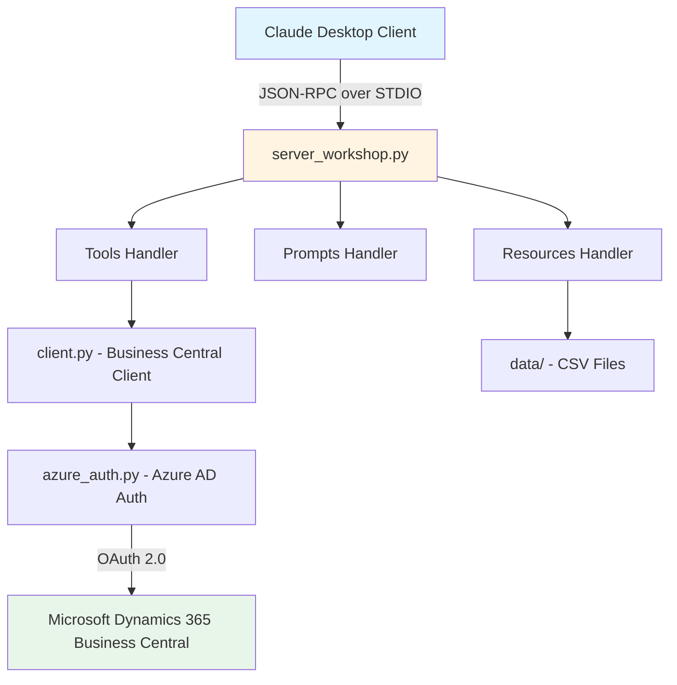
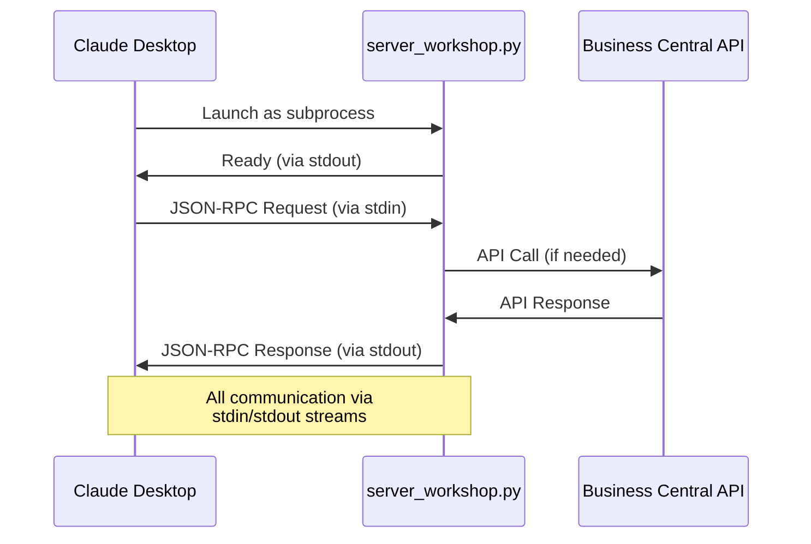

# 🎓 MCP Server Workshop: Complete Step-by-Step Guide

## 📖 Table of Contents

1. [Workshop Overview](#-workshop-overview)
2. [Understanding the Architecture](#-understanding-the-architecture)
3. [Understanding STDIO Transport](#-understanding-stdio-transport)
4. [Key Files Explained](#-key-files-explained)
5. [Step-by-Step Instructions](#-step-by-step-instructions)
6. [Practical Exercises](#-step-9-practical-exercises)
7. [Troubleshooting](#-troubleshooting)

---

## 🎯 Workshop Overview

### What You Will Learn

This workshop teaches you to build an MCP (Model Context Protocol) server with STDIO transport, integrated with Microsoft Dynamics 365 Business Central for Claude Desktop. By the end, you will:

- ✅ Understand MCP architecture and components
- ✅ Configure and run an MCP server with STDIO transport
- ✅ Integrate with Business Central APIs
- ✅ Create custom tools and prompts
- ✅ Test your server with Claude Desktop

### Workshop Duration

- **Target Duration**: 20-30 minutes (core workshop)
- **Extended Learning**: Additional 10-15 minutes for customization exercises

### Prerequisites

- Python 3.12 or higher
- Basic knowledge of JSON
- Claude Desktop installed
- (Optional) Azure AD credentials for Business Central access

---

## 🏗️ Understanding the Architecture

### MCP Server Architecture Overview



### Component Explanation

1. **MCP Server (`server_workshop.py`)**
   - Main entry point for the workshop
   - Implements MCP protocol handlers (tools, prompts, resources)
   - Uses STDIO for communication with Claude Desktop
   - Handles JSON-RPC requests from MCP clients

2. **Configuration (`config.py` + `.env`)**
   - Manages environment variables
   - Stores Azure AD and Business Central credentials
   - Provides configuration validation

3. **Business Central Client (`client.py`)**
   - Handles all communication with Business Central APIs
   - Implements authentication flow
   - Provides methods for querying customers, items, orders, etc.

4. **Azure Authentication (`azure_auth.py`)**
   - Manages OAuth 2.0 authentication with Azure AD (optional)
   - Handles token acquisition and refresh
   - Secures API calls to Business Central
   - Returns None if credentials not configured (enables mock data mode)

---

## 📡 Understanding STDIO Transport

### What is STDIO Transport?

STDIO (Standard Input/Output) transport is the standard method for MCP servers to communicate with desktop applications like Claude Desktop. Instead of using network protocols, communication happens through stdin/stdout streams.



### How STDIO Works

1. **Process Launch**: Claude Desktop launches your MCP server as a child process
2. **Stream Communication**: JSON-RPC messages are sent/received via stdin/stdout
3. **Tool Execution**: When Claude needs data, it calls your tools via JSON-RPC
4. **Results Return**: Your server processes the request and returns results via stdout

### STDIO vs HTTP: Understanding the Difference

While this workshop focuses on STDIO transport, it's helpful to understand when you might use HTTP-based transport instead:

| Aspect | **STDIO** (This Workshop) | **HTTP/SSE** (Alternative) |
|--------|---------------------------|----------------------------|
| **Communication** | stdin/stdout streams | HTTP with Server-Sent Events |
| **Primary Use Case** | Claude Desktop integration | Web services, cloud deployments |
| **Network Required** | No - local process only | Yes - requires network/ports |
| **Setup Complexity** | Simple - just configure path | Medium - requires port config |
| **Security** | Isolated by default | Requires HTTPS in production |
| **Multiple Clients** | No - one client per process | Yes - multiple simultaneous |
| **Testing** | Claude Desktop, direct execution | curl, Postman, web tools |
| **Best For** | Desktop apps, personal tools | Cloud services, team sharing |

**For this workshop**: We use STDIO because it's simpler, more secure by default, and perfect for Claude Desktop integration - ideal for a 20-30 minute learning session.

### Running the STDIO Server

**Direct execution** (for testing):
```bash
# Activate virtual environment
source workshop-env/bin/activate  # Windows: workshop-env\Scripts\activate

# Run the server (will wait for input on stdin)
python server_workshop.py
```

**With Claude Desktop** (automatic):
Configure in `claude_desktop_config.json` and Claude Desktop launches it automatically when needed.

---

## 📁 Key Files Explained

### 1. `.env` - Environment Configuration

**Purpose**: Stores sensitive credentials and configuration values.

**What it contains**:
```env
# Azure Active Directory credentials
AZURE_CLIENT_ID=your-app-client-id
AZURE_CLIENT_SECRET=your-app-secret
AZURE_TENANT_ID=your-tenant-id

# Business Central environment details
BC_ENVIRONMENT=production
BC_COMPANY_ID=your-company-guid

# Server configuration
SERVER_PORT=8000
LOG_LEVEL=INFO
```

**Why it's important**:
- Keeps credentials separate from code
- Allows different configurations per environment
- Protected by `.gitignore` to prevent accidental commits
- Required for the server to connect to Business Central

**How it works in the workshop**:
1. Copy from `.env.example` template
2. Fill in your Azure AD and Business Central credentials
3. The `config.py` module loads these values at runtime
4. If credentials are missing, the server uses mock data

---

### 2. `client.py` - Business Central API Client

**Purpose**: Provides a Python interface to interact with Business Central APIs.

**Key responsibilities**:
- **Authentication**: Uses Azure AD tokens to authenticate API requests
- **API Communication**: Makes HTTP requests to Business Central OData endpoints
- **Data Retrieval**: Fetches customers, items, sales orders, vendors, etc.
- **Error Handling**: Manages API errors and provides fallback to mock data

**Main methods**:
```python
class BusinessCentralClient:
    async def get_customers(self, filter=None, top=50)
    async def get_items(self, filter=None, top=50)
    async def get_sales_orders(self, filter=None, top=50)
    async def get_currency_exchange_rates(self, currency_code=None, top=20)
```

**How it works in the workshop**:
1. Server imports `BusinessCentralClient`
2. When a tool is called (e.g., "get_customers"), the server calls the corresponding client method
3. Client authenticates with Azure AD
4. Client makes OData API request to Business Central
5. Client returns structured data to the server
6. Server formats data and returns to MCP client

**Example flow**:
```
User in Claude Desktop → "Show me top 5 customers"
    ↓
Claude Desktop → MCP Server (tool: get_customers, args: {top: 5})
    ↓
Server → client.get_customers(top=5)
    ↓
Client → Azure AD (get token)
    ↓
Client → Business Central API (/companies/{id}/customers?$top=5)
    ↓
Business Central → Returns customer data
    ↓
Client → Returns data to Server
    ↓
Server → Formats and returns to Claude Desktop
    ↓
Claude Desktop → Displays formatted customer list
```

---

### 3. `config.py` - Configuration Management

**Purpose**: Centralizes configuration loading and validation.

**Key responsibilities**:
- **Load Environment Variables**: Reads from `.env` file
- **Validation**: Ensures required values are present
- **Type Conversion**: Converts string values to appropriate types
- **Defaults**: Provides sensible default values
- **Access**: Single source of truth for all configuration

**Main features**:
```python
class Config:
    # Azure AD Configuration
    AZURE_CLIENT_ID: str
    AZURE_CLIENT_SECRET: str
    AZURE_TENANT_ID: str
    
    # Business Central Configuration
    BC_ENVIRONMENT: str
    BC_COMPANY_ID: str
    BC_BASE_URL: str
    
    # Server Configuration
    SERVER_HOST: str = "0.0.0.0"
    SERVER_PORT: int = 8000
    LOG_LEVEL: str = "INFO"
```

**How it works in the workshop**:
1. On server startup, `config.py` loads `.env` file (if present)
2. Checks if Azure AD and Business Central credentials are configured
3. Provides configuration object to other modules
4. If credentials are missing, runs in **mock data mode** with warnings
5. Other modules access config values via `config.VARIABLE_NAME`

**Benefits**:
- ✅ Single place to manage all settings
- ✅ Works without credentials (mock data mode for learning)
- ✅ Clear warnings for missing configuration
- ✅ Type safety for configuration values
- ✅ Easy to extend with new configuration options

---

### 4. `server_workshop.py` - Main MCP Server

**Purpose**: The core MCP server implementation that ties everything together.

**Key responsibilities**:
- **MCP Protocol Implementation**: Handles JSON-RPC methods (tools/list, tools/call, etc.)
- **Tools**: Implements Business Central operations as MCP tools
- **Prompts**: Provides intelligent prompts for data analysis
- **Resources**: Exposes CSV/JSON data files as MCP resources
- **HTTP Server**: Runs Starlette HTTP server with SSE support

**Main components**:

#### 4.1 Server Initialization
```python
# Create MCP server instance
server = Server("business-central-workshop")

# Initialize Business Central client
bc_client = BusinessCentralClient()
```

#### 4.2 Tool Handlers
```python
@server.list_tools()
async def handle_list_tools():
    """List available MCP tools"""
    return [
        types.Tool(
            name="get_customers",
            description="Get customer list from Business Central",
            inputSchema={...}
        ),
        # ... more tools
    ]

@server.call_tool()
async def handle_call_tool(name: str, arguments: dict):
    """Execute a tool"""
    if name == "get_customers":
        data = await bc_client.get_customers(...)
        return format_response(data)
```

#### 4.3 Prompt Handlers
```python
@server.list_prompts()
async def handle_list_prompts():
    """List available prompts"""
    return [
        types.Prompt(
            name="customer_analysis",
            description="Analyze customer data",
            arguments=[...]
        )
    ]

@server.get_prompt()
async def handle_get_prompt(name: str, arguments: dict):
    """Generate prompt messages"""
    return create_analysis_messages(name, arguments)
```

#### 4.4 Resource Handlers
```python
@server.list_resources()
async def handle_list_resources():
    """List available data resources"""
    return [
        types.Resource(
            uri="file://data/prices.csv",
            name="Price Data",
            mimeType="text/csv"
        ),
        types.Resource(
            uri="file://data/categories.csv",
            name="Categories Data",
            mimeType="text/csv"
        )
    ]
```

#### 4.5 STDIO Transport Main Function
```python
async def main():
    """Main entry point for STDIO transport"""
    async with stdio_server() as (read_stream, write_stream):
        await mcp_server.run(
            read_stream,
            write_stream,
            InitializationOptions(
                server_name="bc-workshop-server",
                server_version="1.0.0"
            )
        )

if __name__ == "__main__":
    asyncio.run(main())
```

**How it works in the workshop**:
1. Claude Desktop launches: `python server_workshop.py`
2. Server initializes MCP server with STDIO transport
3. Communication happens via stdin/stdout (no HTTP ports)
4. MCP client (Claude Desktop) connects via HTTP
5. Client sends JSON-RPC requests (e.g., "tools/list")
6. Server processes request and returns response
7. Student can modify server to add new tools/prompts

---

## 📝 Step-by-Step Instructions

### Option A: Automated Setup (Recommended) ⚡

**For Windows Users:**
```powershell
# Run the automated setup script from the workshop directory
.\setup.ps1

# For help and options:
.\setup.ps1 -Help

# Force recreate virtual environment if needed:
.\setup.ps1 -Force
```

**For macOS/Linux Users:**
```bash
# Make executable and run
chmod +x setup.sh
./setup.sh
```

The automated scripts will handle everything automatically:
- ✅ Check Python version compatibility (3.12+)
- ✅ Create and activate virtual environment properly
- ✅ Install all required dependencies
- ✅ Verify installation works correctly
- ✅ Show you the next steps

**If automated setup succeeds, skip to [Step 6: Testing with Claude Desktop](#-testing-with-claude-desktop).**

### Option B: Manual Setup (Step by Step) 📋

If you prefer manual control or the automated script encounters issues:

### Step 1: Download the Repository

```bash
# 1. Go to: https://github.com/javiarmesto/Workshop-MCP-Server-Directions
# 2. Click the green "Code" button
# 3. Select "Download ZIP"
# 4. Extract the ZIP file to your desired location
# 5. Navigate to the extracted folder:
cd Workshop-MCP-Server-Directions-main
```

**What you'll see**:
```
Workshop-MCP-Server-Directions/
├── server_workshop.py    ← Main server file
├── .env.example          ← Configuration template
├── requirements.txt      ← Python dependencies
├── src/                  ← Source code modules
│   ├── client.py         ← Business Central API client
│   ├── config.py         ← Configuration management
│   └── azure_auth.py     ← Azure AD authentication
├── data/                 ← Sample data files
│   ├── categories.csv
│   ├── prices.csv
│   ├── substitutes.csv
│   ├── sales_orders.csv
│   ├── payment_terms.csv
│   └── price-analysis.json
└── archive/              ← Archived files (HTTP version, old tests)
```

---

### Step 2: Install Python and Dependencies

#### 2.1 Check Python Version

```bash
python --version
# Should show: Python 3.12.x or higher
```

If Python 3.12+ is not installed:
- **Windows**: Download from [python.org](https://python.org)
- **macOS**: `brew install python@3.12`
- **Linux**: `sudo apt install python3.12`

#### 2.2 Create Virtual Environment (Recommended)

```bash
# Create virtual environment
python -m venv workshop-env
```

**🔥 IMPORTANT: Activate Virtual Environment**

**For Windows PowerShell:**
```powershell
.\workshop-env\Scripts\Activate.ps1
```

**For Windows Command Prompt:**
```cmd
workshop-env\Scripts\activate.bat
```

**For macOS/Linux:**
```bash
source workshop-env/bin/activate
```

**✅ Verification:** After activation, your prompt should show `(workshop-env)` at the beginning.

**❌ Troubleshooting Windows:**
- If you get "execution policy" error, run: `Set-ExecutionPolicy -ExecutionPolicy RemoteSigned -Scope CurrentUser`
- Always use `.\` before the path: `.\workshop-env\Scripts\Activate.ps1`

**Why use virtual environment?**
- Isolates workshop dependencies from system Python
- Prevents version conflicts
- Easy to clean up after workshop

#### 2.3 Install Dependencies

**⚠️ IMPORTANT: Make sure virtual environment is activated first!**

Your prompt should show `(workshop-env)` before running:

```bash
pip install -r requirements.txt
```

**If you get permission errors:**

1. Verify virtual environment is activated: `(workshop-env)` in prompt
2. Use: `python -m pip install -r requirements.txt`
3. On Windows, ensure PowerShell execution policy allows scripts

> 🚨 **Setup Issues?** For detailed troubleshooting of common setup problems, see [SETUP_TROUBLESHOOTING.md](SETUP_TROUBLESHOOTING.md)

**What gets installed**:
- `mcp`: Model Context Protocol SDK
- `httpx`: HTTP client for API requests
- `starlette`: ASGI web framework
- `uvicorn`: ASGI server
- `pydantic`: Data validation
- `python-dotenv`: Environment variable loader

---

### Step 3: Configure Environment Variables

#### 3.1 Create Configuration File

```bash
# Copy the template
cp .env.example .env

# Windows (PowerShell):
copy .env.example .env
```

#### 3.2 Edit Configuration

Open `.env` in your text editor and fill in your credentials:

```env
# ========================================
# 🔑 AZURE AD & BUSINESS CENTRAL CONFIG
# ========================================

# Get these from Azure Portal → App Registrations
AZURE_CLIENT_ID=12345678-1234-1234-1234-123456789abc
AZURE_CLIENT_SECRET=your-secret-value-here
AZURE_TENANT_ID=87654321-4321-4321-4321-cba987654321

# Get these from Business Central
BC_ENVIRONMENT=production
BC_COMPANY_ID=abcdef12-3456-7890-abcd-ef1234567890

# Server settings (optional, defaults shown)
SERVER_PORT=8000
LOG_LEVEL=INFO
```

#### 3.3 Where to Get Credentials

**Azure AD Credentials**:
1. Go to [Azure Portal](https://portal.azure.com)
2. Navigate to **Azure Active Directory** → **App registrations**
3. Create new registration or select existing
4. Copy **Application (client) ID** → `AZURE_CLIENT_ID`
5. Copy **Directory (tenant) ID** → `AZURE_TENANT_ID`
6. Go to **Certificates & secrets** → Create new secret
7. Copy the secret value → `AZURE_CLIENT_SECRET`

**Business Central Details**:
1. Go to Business Central admin center
2. **Environment**: Usually "production" or "sandbox"
3. **Company ID**: Navigate to **Companies** → Copy the GUID

**Don't have Business Central access?**
- Don't worry! The server includes mock data
- You can still complete the workshop
- Just leave the BC_ values as placeholders

---

### Step 4: Explore Key Files

Before running the server, let's understand what each key file does:

#### 4.1 Review `server_workshop.py`

```bash
# View the file (first 50 lines)
head -50 server_workshop.py

# Or open in your editor
code server_workshop.py  # VS Code
notepad server_workshop.py  # Windows
nano server_workshop.py  # Linux/macOS
```

**What to look for**:
- 📦 **Imports**: MCP types, Starlette components
- 🔧 **Server setup**: `Server("business-central-workshop")`
- 🛠️ **Tool definitions**: `@server.list_tools()`
- 💬 **Prompt definitions**: `@server.list_prompts()`
- 📊 **Resource definitions**: `@server.list_resources()`

#### 4.2 Review `src/client.py`

**Look for**:
- `BusinessCentralClient` class
- Methods like `get_customers()`, `get_items()`
- How it uses `azure_auth.py` for authentication

#### 4.3 Review `src/config.py`

**Look for**:
- How it loads `.env` file
- Validation of required variables
- Default values for optional settings

#### 4.4 Check Sample Data

```bash
# View sample data files
ls -la data/

# Preview a CSV file (Windows)
Get-Content data/prices.csv -Head 5

# Preview a CSV file (macOS/Linux)
head data/prices.csv
```

---

### Step 5: Validate Your Setup

Run the validation script to ensure everything is configured correctly:

```bash
# Use the Python from virtual environment
.\workshop-env\Scripts\python.exe validate_workshop.py
```

> 💡 **Tip**: If your virtual environment is consistently activated, you can also use `python validate_workshop.py`

**Expected output**:
```
🚀 MCP WORKSHOP VALIDATOR - BUSINESS CENTRAL (STDIO)
============================================================

============================================================
🔍 Python Verification
============================================================
✅ Python 3.13.7 - Compatible

============================================================
🔍 Dependencies Verification
============================================================
✅ mcp
✅ fastmcp
[... more dependencies ...]

✅ All dependencies are installed

============================================================
🔍 Files Verification
============================================================
✅ server_workshop.py
✅ requirements.txt
[... more files ...]

✅ All files are present

============================================================
🔍 Configuration Verification
============================================================
✅ .env file found
✅ Complete configuration

============================================================
🔍 VALIDATION SUMMARY
============================================================
✅ PASS Python Version
✅ PASS Dependencies
✅ PASS Files
✅ PASS Configuration
✅ PASS Data Files
✅ PASS Server Import

📊 RESULT: 6/6 checks passed

🎉 WORKSHOP READY! You can run:
   .\workshop-env\Scripts\python.exe server_workshop.py
```


*Screenshot showing successful validation with all 6 checks passed*

**If validation fails**:
- Check error messages for specific issues
- Ensure Python 3.12+ is installed
- Verify dependencies are installed: `pip install -r requirements.txt`
- Make sure `.env` file exists

---

### Step 6: Run the Workshop Server

#### 6.1 Start the Server (For Testing)

**IMPORTANT**: This server uses STDIO transport and is designed for Claude Desktop integration. For standalone testing, you can run:

```bash
.\workshop-env\Scripts\python.exe server_workshop.py
```

> 💡 **Tip**: Alternatively, you can use `python server_workshop.py` if your virtual environment is properly activated

**Expected output (STDIO Server)**:
```
2025-10-11 10:11:03,178 INFO __main__: 🌟 Starting MCP Workshop Server with STDIO transport
2025-10-11 10:11:03,178 INFO __main__: 📡 Ready for Claude Desktop connection
[Server waits for STDIO input/output from Claude Desktop]
```

**Note**: The server will appear to "hang" - this is normal! It's waiting for JSON-RPC messages from Claude Desktop via stdin/stdout. Press `Ctrl+C` to stop.

**For actual usage**, configure this server in Claude Desktop (see [Step 7](#-testing-with-claude-desktop)).

**Server is now running!** Keep this terminal open.

#### 6.2 Test Server Communication (STDIO)

**Important**: STDIO servers don't respond to HTTP requests. Instead, they communicate via JSON-RPC over stdin/stdout. Here's how to test it:

**Method 1: Simple JSON-RPC Test**
```bash
# In a NEW terminal window (keep the server running in the first one)
cd "C:\Users\YOUR_USERNAME\Documents\AL\Workshop-MCP-Server-Directions-Lab"
.\workshop-env\Scripts\Activate.ps1

# Send a simple initialization message
echo '{"jsonrpc": "2.0", "id": 1, "method": "initialize", "params": {"protocolVersion": "2024-11-05", "capabilities": {}, "clientInfo": {"name": "test-client", "version": "1.0"}}}' | .\workshop-env\Scripts\python.exe server_workshop.py
```

**Expected response (JSON-RPC format)**:
```json
{
  "jsonrpc": "2.0",
  "id": 1,
  "result": {
    "protocolVersion": "2024-11-05",
    "capabilities": {
      "tools": {},
      "prompts": {},
      "resources": {}
    },
    "serverInfo": {
      "name": "bc-workshop-server",
      "version": "1.0.0"
    }
  }
}
```

**Method 2: Verify with Python Validator**
```bash
# This is the easiest way to verify everything works
.\workshop-env\Scripts\python.exe validate_workshop.py
```

**Method 3: Check Server Logs**
In the terminal where the server is running, you should see:
```
INFO __main__: 🌟 Starting MCP Workshop Server with STDIO transport
INFO __main__: 📡 Ready for Claude Desktop connection
```

---

### Step 7: Testing with Claude Desktop

**Important**: This server is designed for Claude Desktop integration using STDIO transport. For testing MCP functionalities, we'll use our test scripts and then configure Claude Desktop.

#### 7.1 Test MCP Tools with Script

Let's test the available tools using our comprehensive test script:

```powershell
# Create a simple tool test
.\workshop-env\Scripts\python.exe -c "
import json
import subprocess
import sys
import os

# Test message for listing tools
list_tools_msg = {
    'jsonrpc': '2.0', 
    'id': 1, 
    'method': 'tools/list', 
    'params': {}
}

# Start server process
process = subprocess.Popen(
    [os.path.join('workshop-env', 'Scripts', 'python.exe'), 'server_workshop.py'],
    stdin=subprocess.PIPE,
    stdout=subprocess.PIPE,
    stderr=subprocess.PIPE,
    text=True
)

# Send initialize first
init_msg = {
    'jsonrpc': '2.0',
    'id': 0,
    'method': 'initialize',
    'params': {
        'protocolVersion': '2024-11-05',
        'capabilities': {},
        'clientInfo': {'name': 'test', 'version': '1.0'}
    }
}

try:
    # Send messages
    input_data = json.dumps(init_msg) + '\n' + json.dumps(list_tools_msg) + '\n'
    stdout, stderr = process.communicate(input=input_data, timeout=10)
    
    print('📋 Available Tools:')
    lines = stdout.strip().split('\n')
    for line in lines:
        if line.strip():
            try:
                response = json.loads(line)
                if 'result' in response and 'tools' in response.get('result', {}):
                    for tool in response['result']['tools']:
                        print(f'  ✅ {tool[\"name\"]}: {tool[\"description\"]}')
            except: pass
                        
except Exception as e:
    print(f'Error: {e}')
finally:
    try: process.kill()
    except: pass
"
```

**Expected tools available:**
- ✅ `get_customers` - 🏢 Get customer list from Business Central
- ✅ `get_items` - 📦 Get items/products from Business Central  
- ✅ `get_sales_orders` - 📋 Get sales orders from Business Central
- ✅ `get_customer_details` - 👤 Get detailed customer information
- ✅ `get_item_details` - 🔍 Get detailed item information
- ✅ `get_currency_exchange_rates` - 💱 Get currency exchange rates

#### 7.2 Configure Claude Desktop

To use this server with Claude Desktop, you need to configure it in Claude's settings:

**Step 1: Find Claude Desktop Config File**

**Windows**: `%APPDATA%\Claude\claude_desktop_config.json`  
**macOS**: `~/Library/Application Support/Claude/claude_desktop_config.json`


*Screenshot showing the location and structure of the Claude Desktop configuration file*

**Step 2: Add MCP Server Configuration**

Edit the config file to add your server:

```json
{
  "mcpServers": {
    "bc-workshop-server": {
      "command": "C:/Users/YOUR_USERNAME/Documents/AL/Workshop-MCP-Server-Directions-Lab/workshop-env/Scripts/python.exe",
      "args": ["C:/Users/YOUR_USERNAME/Documents/AL/Workshop-MCP-Server-Directions-Lab/server_workshop.py"]
    }
  }
}
```

**Important**: Replace `YOUR_USERNAME` with your actual Windows username.

**Step 3: Restart Claude Desktop**

Close and reopen Claude Desktop for the changes to take effect.

**Step 4: Verify Connection**

In Claude Desktop, you should be able to ask:
- "What MCP tools are available?"
- "Show me the Business Central customers"
- "Get some items from the catalog"

#### 7.3 Test Individual MCP Functions

Now let's test calling specific MCP tools:

**Test get_customers tool:**

```powershell
.\workshop-env\Scripts\python.exe -c "
import sys
sys.path.insert(0, '.')
import server_workshop
import asyncio
import json

async def test_get_customers():
    print('🧪 Testing get_customers tool')
    print('=' * 35)
    
    arguments = {'top': 5}
    result = await server_workshop.handle_call_tool('get_customers', arguments)
    
    print('📋 Customer Data (Top 5):')
    print('-' * 25)
    for item in result:
        if hasattr(item, 'text'):
            try:
                data = json.loads(item.text)
                if isinstance(data, list):
                    for i, customer in enumerate(data, 1):
                        name = customer.get('name', 'Unknown')
                        city = customer.get('city', 'N/A')
                        phone = customer.get('phoneNumber', 'N/A')
                        print(f'  {i}. {name}')
                        print(f'     📍 {city} | 📞 {phone}')
                        print()
                    break
            except:
                print(f'Raw response: {item.text[:200]}...')
                break

asyncio.run(test_get_customers())
"
```

**Expected output:**
```
🧪 Testing get_customers tool
===================================
📋 Customer Data (Top 5):
-------------------------
  1. Adatum Corporation
     📍 Atlanta | 📞 555-0123
     
  2. Trey Research  
     📍 New York | 📞 555-0456
     
  3. School of Fine Art
     📍 Miami | 📞 555-0789
     
  [... more customers ...]
```

**Test get_items tool:**

```powershell
.\workshop-env\Scripts\python.exe -c "
import sys
sys.path.insert(0, '.')
import server_workshop
import asyncio
import json

async def test_get_items():
    print('🧪 Testing get_items tool')
    print('=' * 30)
    
    arguments = {'top': 3}
    result = await server_workshop.handle_call_tool('get_items', arguments)
    
    print('📦 Item Data (Top 3):')
    print('-' * 20)
    for item in result:
        if hasattr(item, 'text'):
            try:
                data = json.loads(item.text)
                if isinstance(data, list):
                    for i, product in enumerate(data, 1):
                        name = product.get('displayName', 'Unknown')
                        price = product.get('unitPrice', 0)
                        stock = product.get('quantityOnHand', 0)
                        print(f'  {i}. {name}')
                        print(f'     💰 ${price} | 📊 Stock: {stock}')
                        print()
                    break
            except:
                print(f'Raw response: {item.text[:200]}...')
                break

asyncio.run(test_get_items())
"
```

**Expected output:**
```
🧪 Testing get_items tool
==============================
📦 Item Data (Top 3):
--------------------
  1. ATHENS Desk
     💰 $2000.0 | 📊 Stock: 15
     
  2. PARIS Guest Chair
     💰 $800.0 | 📊 Stock: 25
     
  3. LONDON Swivel Chair
     💰 $1200.0 | 📊 Stock: 12
```

**Test currency exchange rates:**

```powershell
.\workshop-env\Scripts\python.exe -c "
import sys
sys.path.insert(0, '.')
import server_workshop
import asyncio
import json

async def test_currency_rates():
    print('🧪 Testing get_currency_exchange_rates tool')
    print('=' * 45)
    
    result = await server_workshop.handle_call_tool('get_currency_exchange_rates', {})
    
    print('💱 Currency Exchange Rates:')
    print('-' * 25)
    for item in result:
        if hasattr(item, 'text'):
            try:
                data = json.loads(item.text)
                if isinstance(data, list):
                    for rate in data[:5]:  # Show first 5
                        currency = rate.get('currencyCode', 'Unknown')
                        exchange_rate = rate.get('exchangeRate', 0)
                        print(f'  💰 {currency}: {exchange_rate}')
                    break
            except:
                print(f'Raw response: {item.text[:200]}...')
                break

asyncio.run(test_currency_rates())
"
```

---

### Step 8: Configure Claude Desktop Integration

Now let's configure Claude Desktop to use our MCP server for real-world testing.

#### 8.1 Locate Claude Configuration File

**Windows**:
```
%APPDATA%\Claude\claude_desktop_config.json
```

**macOS**:
```
~/Library/Application Support/Claude/claude_desktop_config.json
```

**Find your exact path:**
```powershell
# Windows - Check if file exists
Get-ChildItem "$env:APPDATA\Claude\" -Filter "claude_desktop_config.json" -ErrorAction SilentlyContinue

# If file doesn't exist, create the directory
New-Item -ItemType Directory -Force -Path "$env:APPDATA\Claude"
```

#### 8.2 Create/Edit MCP Server Configuration

**Step 1: Get Your Exact Paths**

First, let's find your paths. Run these commands in PowerShell:

```powershell
# Get your workshop directory
$workshopPath = (Get-Location).Path
Write-Host "Workshop Path: $workshopPath"

# Get Python executable path (convert to forward slashes for JSON)
$pythonPath = "$workshopPath\workshop-env\Scripts\python.exe" -replace '\\', '/'
Write-Host "Python Path: $pythonPath"

# Get server script path (convert to forward slashes for JSON)
$serverPath = "$workshopPath\server_workshop.py" -replace '\\', '/'
Write-Host "Server Path: $serverPath"
```

**Step 2: Open Claude Configuration File**

```powershell
# Open the config file in notepad
notepad "$env:APPDATA\Claude\claude_desktop_config.json"

# If file doesn't exist, create the directory first
New-Item -ItemType Directory -Force -Path "$env:APPDATA\Claude"
```

**Step 3: Create the Configuration**

Copy this template and **replace the paths** with the ones you got from Step 1:

# Get server script path
$serverPath = "$workshopPath\server_workshop.py"
Write-Host "Server Path: $serverPath"
```

**Create or edit the Claude configuration file:**

```json
{
  "mcpServers": {
    "bc-workshop-server": {
      "command": "C:/Users/YOUR_USERNAME/Documents/AL/Workshop-MCP-Server-Directions-Lab/workshop-env/Scripts/python.exe",
      "args": [
        "C:/Users/YOUR_USERNAME/Documents/AL/Workshop-MCP-Server-Directions-Lab/server_workshop.py"
      ],
      "env": {
        "PYTHONPATH": "C:/Users/YOUR_USERNAME/Documents/AL/Workshop-MCP-Server-Directions-Lab"
      }
    }
  }
}
```

**⚠️ CRITICAL: Use Full Python Path**

During our testing, we discovered that even with the virtual environment activated, using just `python` may not work correctly in PowerShell. **Always use the full path to the Python executable** as shown in the configuration above.

**⚠️ IMPORTANT**: Replace `YOUR_USERNAME` with your actual Windows username!

**Example with real paths:**
```json
{
  "mcpServers": {
    "bc-workshop-server": {
      "command": "C:/Users/JavierArmestoGonzále/Documents/AL/Workshop-MCP-Server-Directions-Lab/workshop-env/Scripts/python.exe",
      "args": [
        "C:/Users/JavierArmestoGonzále/Documents/AL/Workshop-MCP-Server-Directions-Lab/server_workshop.py"
      ],
      "env": {
        "PYTHONPATH": "C:/Users/JavierArmestoGonzále/Documents/AL/Workshop-MCP-Server-Directions-Lab"
      }
    }
  }
}
```

#### 8.3 Restart Claude Desktop

1. **Quit Claude Desktop completely** (not just minimize)
2. **Restart Claude Desktop**
3. **Look for the MCP indicator** - You should see a tool/plugin icon
4. **Check for errors** in Claude's developer console if needed

#### 8.4 Test MCP Integration in Claude Desktop

Try these prompts in Claude Desktop:

**Basic connectivity:**
- "What MCP servers are connected?"
- "Show me available tools"
- "List MCP capabilities"

**Business Central data:**
- "Get the top 5 customers from Business Central"
- "Show me some items from the catalog"
- "What currency exchange rates are available?"

**Expected responses:**
Claude should be able to:
- ✅ List the 6 available tools (get_customers, get_items, etc.)
- ✅ Fetch real customer data from Business Central
- ✅ Show item catalog with prices and stock
- ✅ Display currency exchange rates

**Visual verification:**


*Screenshot showing the expected MCP tools display in Claude Desktop*

When you ask Claude "Show me available tools", you should see all 6 Business Central tools listed with their descriptions.

#### 8.5 Verify MCP Connection

If Claude Desktop connects successfully, you should see:

**In Claude's interface:**
- Tool/plugin icon indicating MCP connection
- Ability to call Business Central functions
- Real data responses from your queries

**In your terminal (if server is running):**
```
INFO __main__: 🌟 Starting MCP Workshop Server with STDIO transport
INFO __main__: 📡 Ready for Claude Desktop connection
INFO server_workshop: 📞 Calling tool: get_customers with arguments: {'top': 5}
INFO httpx: HTTP Request: POST https://login.microsoftonline.com/...
```

#### 8.6 Troubleshooting Claude Desktop Configuration

**Problem: "Could not load application settings" or "Unexpected token" JSON error**

This is the most common issue when configuring Claude Desktop. It happens when the JSON file has syntax errors, often caused by:
- Line breaks within string values
- Missing commas or brackets
- Incorrect escape characters

**Solution: Validate and Fix Your JSON**

```powershell
# Test if the JSON is valid
Get-Content "$env:APPDATA\Claude\claude_desktop_config.json" | ConvertFrom-Json

# If you see errors, the JSON is malformed
# If no errors, the JSON is valid
```

**Common mistakes:**
```json
// ❌ WRONG - Line break in the middle of a string
{
  "command": "C:/Users/MyName/Documents/Workshop
/python.exe"
}

// ✅ CORRECT - String on single line
{
  "command": "C:/Users/MyName/Documents/Workshop/python.exe"
}
```

**Checklist before saving:**
- ✅ All paths use forward slashes `/` (not backslashes `\`)
- ✅ No line breaks within string values
- ✅ All brackets and braces match `{ }` and `[ ]`
- ✅ Commas after each property (except the last one)

**After fixing:**
1. Save the file
2. Close Claude Desktop completely (check system tray)
3. Restart Claude Desktop

> 💡 **Quick Fix**: If you're stuck, use the automatic script: `.\configure_claude.ps1`

---

## 🎓 Step 9: Practical Exercises

Welcome to the hands-on section! You'll learn by doing:
- **Part A (Exercises 1-2)**: Test existing MCP tools
- **Part B (Exercises 3-4)**: Implement new tools using Business Central Standard APIs

> ⚠️ **Important**: We use only **Standard Business Central APIs** (no custom extensions)

---

## Part A: Testing Existing Tools

### Exercise 1: Test Customer Tools

**Goal**: Learn how to use existing MCP tools through Claude Desktop.

**Tools to test**:
1. `get_customers` - Lists customers from Business Central
2. `customer_analysis` prompt - Detailed customer analysis template

**Step-by-step testing**:

1. **Open Claude Desktop** (ensure your MCP server is configured from Step 8)

2. **Test get_customers tool**:
   ```
   Ask Claude: "Show me the top 5 customers"
   ```
   
   **Expected result**: Claude calls `get_customers` and shows customer data with names, IDs, and balances.

3. **Test customer_analysis prompt**:
   ```
   Ask Claude: "Analyze customer Adatum Corporation"
   ```
   
   **Expected result**: Claude uses the `customer_analysis` prompt template to create a detailed analysis.

**Study the code**:
- Open `server_workshop.py`
- Find `handle_list_tools()` → look for `get_customers` tool definition
- Find `handle_list_prompts()` → look for `customer_analysis` prompt
- See how the tool schema defines parameters (`top` parameter)

**More prompts to try**:
- "List all customers with their balances"
- "Show me customer details for Adatum"
- "What customers do we have in the system?"

---

### Exercise 2: Test Currency Exchange Rates

**Goal**: Use a tool that calls Business Central's standard `/currencies` API.

**API Used**: `GET /api/v2.0/companies({id})/currencies` (Standard BC API)

**Step-by-step testing**:

1. **Test the tool in Claude Desktop**:
   ```
   Ask Claude: "What are the current currency exchange rates?"
   ```
   
   **Expected result**: List of currencies (EUR, USD, GBP, etc.) with their exchange rates.

2. **Study the implementation**:
   - Open `src/client.py`
   - Find `get_currency_exchange_rates()` method
   - See how it calls the **standard** Business Central API: `f"{self.base_url}/currencies"`
   - This is a **read-only** operation on a standard entity

**Try these variations**:
- "Show me all available currencies"
- "What's the exchange rate for EUR?"
- "List currency rates"

**Key Learning**: This tool demonstrates calling a **standard Business Central API endpoint** without any custom extensions.

---

## Part B: Implementing New Tools (Copy-Paste & Learn)

Now you'll add **2 new tools** using standard Business Central APIs. Each exercise provides complete code ready to copy-paste.

### Exercise 3: Implement `get_sales_orders` Tool

**Goal**: Add a new tool that fetches sales orders using the **standard Business Central API**.

**API Used**: `GET /api/v2.0/companies({id})/salesOrders` (Standard BC API)

**What you'll learn**:
- How to define a new MCP tool
- How to add parameters (limit, filters)
- How to handle the tool call
- How to work with mock data

---

#### Step 3.1: Create Mock Data File

First, create mock data for testing without Business Central access:

```powershell
# Create the mock data file
New-Item -Path ".\data\sales_orders.csv" -ItemType File
```

**Copy this content** into `data/sales_orders.csv`:

```csv
id,number,orderDate,customerNumber,customerName,totalAmountExcludingTax,currencyCode,status
SO001,1001,2024-01-15,10000,Adatum Corporation,5000.00,USD,Open
SO002,1002,2024-01-20,20000,Contoso Ltd,7500.50,EUR,Open
SO003,1003,2024-01-25,10000,Adatum Corporation,3200.00,USD,Shipped
SO004,1004,2024-02-01,30000,Fabrikam Inc,12000.00,GBP,Open
SO005,1005,2024-02-05,20000,Contoso Ltd,8500.00,EUR,Invoiced
```

---

#### Step 3.2: Add Tool to Client (src/client.py)

Open `src/client.py` and **add this method** after the `get_currency_exchange_rates()` method (around line 180):

```python
    async def get_sales_orders(self, top: int = 20) -> List[Dict[str, Any]]:
        """
        Get sales orders from Business Central
        Uses standard API: GET /salesOrders
        
        Args:
            top: Maximum number of records to return
            
        Returns:
            List of sales orders
        """
        try:
            # Use mock data if no Business Central credentials
            if not self.access_token:
                logger.info("📁 Using mock sales orders data")
                return self._get_mock_sales_orders(top)
            
            # Call standard Business Central API
            endpoint = f"{self.base_url}/salesOrders"
            params = {"$top": top}
            
            async with httpx.AsyncClient() as client:
                response = await client.get(
                    endpoint,
                    headers=self.headers,
                    params=params,
                    timeout=30.0
                )
                response.raise_for_status()
                data = response.json()
                return data.get("value", [])
                
        except Exception as e:
            logger.error(f"Error fetching sales orders: {e}")
            return self._get_mock_sales_orders(top)
    
    def _get_mock_sales_orders(self, top: int = 20) -> List[Dict[str, Any]]:
        """Load sales orders from CSV file"""
        csv_path = Path(__file__).parent.parent / "data" / "sales_orders.csv"
        
        if not csv_path.exists():
            return []
        
        orders = []
        with open(csv_path, 'r', encoding='utf-8') as f:
            reader = csv.DictReader(f)
            for row in list(reader)[:top]:
                orders.append(row)
        
        return orders
```

---

#### Step 3.3: Register Tool in Server (server_workshop.py)

Open `server_workshop.py`:

**1. Add tool definition** in `handle_list_tools()` - add this BEFORE the closing bracket (around line 110):

```python
            # Sales Orders Tool - Standard BC API
            types.Tool(
                name="get_sales_orders",
                description="📋 Get sales orders from Business Central using standard API",
                inputSchema={
                    "type": "object",
                    "properties": {
                        "top": {
                            "type": "number",
                            "description": "Maximum number of orders to return (default: 20)",
                            "default": 20
                        }
                    }
                }
            ),
```

**2. Add tool handler** in `handle_call_tool()` - add this BEFORE the final `else` clause (around line 200):

```python
        elif tool_name == "get_sales_orders":
            top = arguments.get("top", 20)
            logger.info(f"📞 Calling tool: {tool_name} with top={top}")
            
            result = await bc_client.get_sales_orders(top=top)
            
            return types.CallToolResult(content=[
                types.TextContent(
                    type="text",
                    text=json.dumps(result, indent=2, ensure_ascii=False)
                )
            ])
```

---

#### Step 3.4: Test Your New Tool

**1. Restart Claude Desktop**:
   - Close Claude Desktop completely
   - Reopen it (MCP server will restart automatically)

**2. Verify the tool appears**:
   - In Claude Desktop, you should now see **7 tools** (was 6 before)
   - Look for `get_sales_orders` in the list

**3. Test the tool**:
   ```
   Ask Claude: "Show me the sales orders"
   Ask Claude: "Get the top 5 sales orders"
   Ask Claude: "List sales orders for customer Adatum"
   ```

**Expected result**: Claude calls your new `get_sales_orders` tool and shows the data from `sales_orders.csv`.

**🎉 Congratulations!** You just implemented your first MCP tool using a **standard Business Central API**.

---

### Exercise 4: Implement `get_payment_terms` Tool

**Goal**: Add another tool using Business Central's standard `/paymentTerms` API.

**API Used**: `GET /api/v2.0/companies({id})/paymentTerms` (Standard BC API)

**What's different**: This tool has **no parameters** - it just lists all payment terms.

---

#### Step 4.1: Create Mock Data File

```powershell
# Create the mock data file
New-Item -Path ".\data\payment_terms.csv" -ItemType File
```

**Copy this content** into `data/payment_terms.csv`:

```csv
id,code,displayName,dueDateCalculation,discountDateCalculation,discountPercent
PT001,NET30,Net 30 Days,30D,0D,0
PT002,NET15,Net 15 Days,15D,0D,0
PT003,COD,Cash on Delivery,0D,0D,0
PT004,210NET30,2/10 Net 30,30D,10D,2
PT005,NET60,Net 60 Days,60D,0D,0
```

---

#### Step 4.2: Add Tool to Client (src/client.py)

Add this method after `get_sales_orders()`:

```python
    async def get_payment_terms(self) -> List[Dict[str, Any]]:
        """
        Get payment terms from Business Central
        Uses standard API: GET /paymentTerms
        
        Returns:
            List of payment terms
        """
        try:
            # Use mock data if no Business Central credentials
            if not self.access_token:
                logger.info("📁 Using mock payment terms data")
                return self._get_mock_payment_terms()
            
            # Call standard Business Central API
            endpoint = f"{self.base_url}/paymentTerms"
            
            async with httpx.AsyncClient() as client:
                response = await client.get(
                    endpoint,
                    headers=self.headers,
                    timeout=30.0
                )
                response.raise_for_status()
                data = response.json()
                return data.get("value", [])
                
        except Exception as e:
            logger.error(f"Error fetching payment terms: {e}")
            return self._get_mock_payment_terms()
    
    def _get_mock_payment_terms(self) -> List[Dict[str, Any]]:
        """Load payment terms from CSV file"""
        csv_path = Path(__file__).parent.parent / "data" / "payment_terms.csv"
        
        if not csv_path.exists():
            return []
        
        terms = []
        with open(csv_path, 'r', encoding='utf-8') as f:
            reader = csv.DictReader(f)
            for row in reader:
                terms.append(row)
        
        return terms
```

---

#### Step 4.3: Register Tool in Server (server_workshop.py)

**1. Add tool definition** in `handle_list_tools()`:

```python
            # Payment Terms Tool - Standard BC API
            types.Tool(
                name="get_payment_terms",
                description="💳 Get payment terms from Business Central using standard API",
                inputSchema={
                    "type": "object",
                    "properties": {}
                }
            ),
```

**2. Add tool handler** in `handle_call_tool()`:

```python
        elif tool_name == "get_payment_terms":
            logger.info(f"📞 Calling tool: {tool_name}")
            
            result = await bc_client.get_payment_terms()
            
            return types.CallToolResult(content=[
                types.TextContent(
                    type="text",
                    text=json.dumps(result, indent=2, ensure_ascii=False)
                )
            ])
```

---

#### Step 4.4: Test Your Tool

**1. Restart Claude Desktop**

**2. Verify**:
   - You should now see **8 tools** total
   - Look for `get_payment_terms`

**3. Test**:
   ```
   Ask Claude: "What payment terms are available?"
   Ask Claude: "Show me all payment terms"
   Ask Claude: "List the payment options"
   ```

**Expected result**: Claude shows payment terms from your CSV file.

---

## 🎯 What You've Learned

### Part A (Testing):
✅ How to test MCP tools in Claude Desktop  
✅ How prompts work  
✅ Understanding standard Business Central APIs  

### Part B (Implementation):
✅ **Tool structure**: name, description, inputSchema  
✅ **Client methods**: calling BC APIs + mock data fallback  
✅ **Tool handlers**: processing requests and returning results  
✅ **Mock data**: CSV files for testing  
✅ **Standard BC APIs**: `/salesOrders`, `/paymentTerms`  

### Key Concepts:
- **Standard APIs**: No custom extensions needed
- **Mock data**: Works without BC credentials
- **Copy-paste learning**: See complete working examples
- **Incremental testing**: Test after each change

---

## 🚀 Next Steps

Now that you understand the pattern, you can add more tools using other **standard Business Central APIs**:

- `salesInvoices` - Sales invoices
- `purchaseOrders` - Purchase orders
- `purchaseInvoices` - Purchase invoices
- `vendors` - Vendor list (similar to customers)
- `dimensions` - Dimension values
- `shipmentMethods` - Shipping methods

**Pattern to follow**:
1. Create mock CSV data
2. Add async method in `client.py`
3. Register tool in `server_workshop.py` (definition + handler)
4. Test in Claude Desktop

**Happy coding!** 🎉

---

## 🔍 Troubleshooting

### Server won't start

**Error**: `ModuleNotFoundError: No module named 'mcp'`
```bash
# Solution: Install dependencies
pip install -r requirements.txt
```

**Error**: `Port 8000 is already in use`
```bash
# Solution: Change port in .env
SERVER_PORT=8001

# Or find and kill the process using port 8000
# Windows:
netstat -ano | findstr :8000
taskkill /PID <process_id> /F

# Linux/macOS:
lsof -ti:8000 | xargs kill -9
```

### Configuration issues

**Error**: `AZURE_CLIENT_ID not found in environment`
```bash
# Solution: Create .env file
cp .env.example .env
# Then edit .env with your credentials
```

### Business Central API errors

**Error**: `401 Unauthorized`
- Check Azure AD credentials in `.env`
- Verify app registration has correct API permissions
- Ensure token is not expired

**Error**: `404 Not Found`
- Verify BC_ENVIRONMENT and BC_COMPANY_ID are correct
- Check if company exists in Business Central

### Claude Desktop integration issues

**Server not showing in Claude**:
1. Check configuration file path is correct
2. Use absolute paths, not relative
3. Restart Claude Desktop completely
4. Check Claude Desktop logs for errors

**Tools not working**:
1. Ensure server is running
2. Check server logs for errors
3. Verify MCP protocol requests in logs

---

## 🎉 Congratulations!

You've completed the MCP Server Workshop! You now understand:

- ✅ MCP architecture and protocol
- ✅ How to configure and run an MCP server
- ✅ Business Central API integration
- ✅ Creating tools, prompts, and resources
- ✅ Testing with Claude Desktop

### Next Steps

1. **Customize**: Add your own tools for specific Business Central operations
2. **Extend**: Integrate other data sources
3. **Deploy**: Deploy your server to production
4. **Learn More**: Study the MCP specification at [modelcontextprotocol.io](https://modelcontextprotocol.io)

### Resources

- **MCP Documentation**: [spec.modelcontextprotocol.io](https://spec.modelcontextprotocol.io)
- **Business Central API**: [Microsoft Docs](https://learn.microsoft.com/dynamics365/business-central/dev-itpro/api-reference/)
- **Repository**: [GitHub](https://github.com/javiarmesto/Workshop-MCP-Server-Directions)

---

**Happy coding!** 🚀
