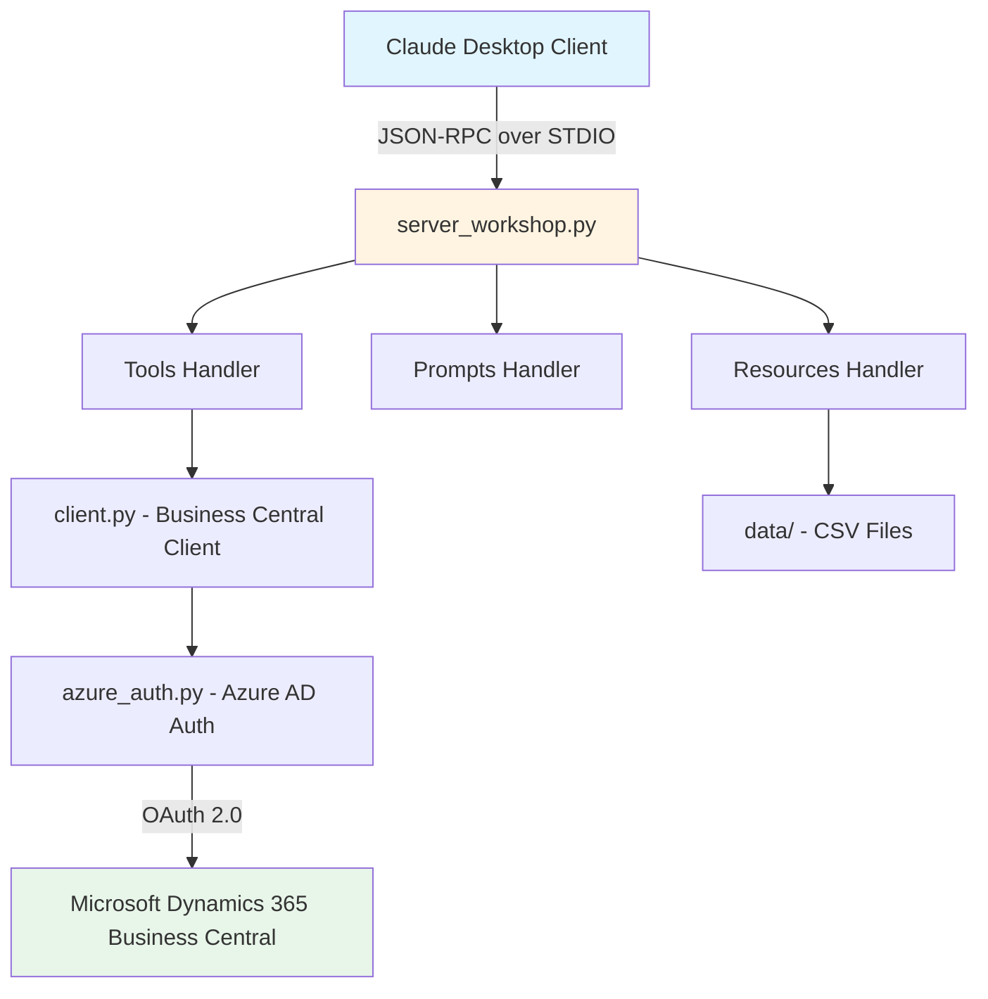
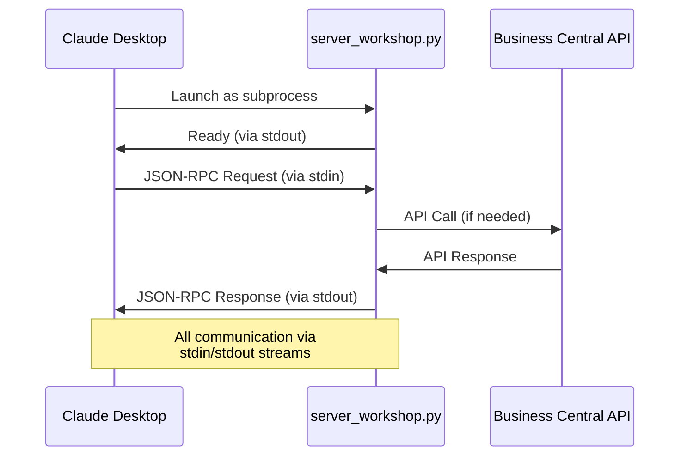

# 🚀 MCP Server Workshop: Complete Step-by-Step Guide

## 📋 Table of Contents

1. [Workshop Overview](#-workshop-overview)
2. [Understanding the Architecture](#-understanding-the-architecture)
3. [Understanding STDIO Transport](#-understanding-stdio-transport)
4. [Key Files Explained](#-key-files-explained)
5. [Step-by-Step Instructions](#-step-by-step-instructions)
6. [Practical Exercises](#-step-10-practical-exercises)
7. [Troubleshooting](#-troubleshooting)

---

## 🎯 Workshop Overview

### 📚 What You Will Learn

This workshop teaches you to build an MCP (Model Context Protocol) server with STDIO transport, integrated with Microsoft Dynamics 365 Business Central for Claude Desktop. By the end, you will:

- Understand MCP architecture and components
- Configure and run an MCP server with STDIO transport
- Integrate with Business Central APIs
- Create custom tools and prompts
- Test your server with Claude Desktop

### ⏱️ Workshop Duration

- **Target Duration**: 20-30 minutes (core workshop)
- **Extended Learning**: Additional 10-15 minutes for customization exercises

### ✅ Prerequisites

- Python 3.12 or higher
- Basic knowledge of JSON
- Claude Desktop installed
- (Optional) Azure AD credentials for Business Central access

---

## 🏗️ Understanding the Architecture

### MCP Server Architecture Overview



### Component Explanation

1. **MCP Server (`server_workshop.py`)**
 - Main entry point for the workshop
 - Implements MCP protocol handlers (tools, prompts, resources)
 - Uses STDIO for communication with Claude Desktop
 - Handles JSON-RPC requests from MCP clients

2. **Configuration (`config.py` + `.env`)**
 - Manages environment variables
 - Stores Azure AD and Business Central credentials
 - Provides configuration validation

3. **Business Central Client (`client.py`)**
 - Handles all communication with Business Central APIs
 - Implements authentication flow
 - Provides methods for querying customers, items, orders, etc.

4. **Azure Authentication (`azure_auth.py`)**
 - Manages OAuth 2.0 authentication with Azure AD (optional)
 - Handles token acquisition and refresh
 - Secures API calls to Business Central
 - Returns None if credentials not configured (enables mock data mode)

---

## 🔌 Understanding STDIO Transport

### What is STDIO Transport?

STDIO (Standard Input/Output) transport is the standard method for MCP servers to communicate with desktop applications like Claude Desktop. Instead of using network protocols, communication happens through stdin/stdout streams.



### How STDIO Works

1. **Process Launch**: Claude Desktop launches your MCP server as a child process
2. **Stream Communication**: JSON-RPC messages are sent/received via stdin/stdout
3. **Tool Execution**: When Claude needs data, it calls your tools via JSON-RPC
4. **Results Return**: Your server processes the request and returns results via stdout

### STDIO vs HTTP: Understanding the Difference

While this workshop focuses on STDIO transport, it's helpful to understand when you might use HTTP-based transport instead:

| Aspect | **STDIO** (This Workshop) | **HTTP/SSE** (Alternative) |
|--------|---------------------------|----------------------------|
| **Communication** | stdin/stdout streams | HTTP with Server-Sent Events |
| **Primary Use Case** | Claude Desktop integration | Web services, cloud deployments |
| **Network Required** | No - local process only | Yes - requires network/ports |
| **Setup Complexity** | Simple - just configure path | Medium - requires port config |
| **Security** | Isolated by default | Requires HTTPS in production |
| **Multiple Clients** | No - one client per process | Yes - multiple simultaneous |
| **Testing** | Claude Desktop, direct execution | curl, Postman, web tools |
| **Best For** | Desktop apps, personal tools | Cloud services, team sharing |

**For this workshop**: We use STDIO because it's simpler, more secure by default, and perfect for Claude Desktop integration - ideal for a 20-30 minute learning session.

### Running the STDIO Server

**Direct execution** (for testing):
```bash
# Activate virtual environment
source workshop-env/bin/activate # Windows: workshop-env\Scripts\activate

# Run the server (will wait for input on stdin)
python server_workshop.py
```

**With Claude Desktop** (automatic):
Configure in `claude_desktop_config.json` and Claude Desktop launches it automatically when needed.

---

## 📁 Key Files Explained


### Repository Structure (clean view)

```text
Workshop-MCP-Server-Directions-Lab/
├─ server_workshop.py            # Main MCP server entry point (STDIO)
├─ src/
│  ├─ client.py                  # Business Central API client (httpx + AAD auth)
│  ├─ config.py                  # Env loading and validation (AZURE_* + BC_*)
│  ├─ tools/                     # Tool handlers exposed to MCP (get_*)
│  └─ data/                      # Mock JSON data for offline mode
├─ tests/
│  ├─ test_server.py             # Lists tools and sanity-checks server
│  └─ validate_workshop.py       # Environment and dependency checks
├─ scripts/
│  ├─ ConfigurationPaths.ps1

#### Troubleshooting: PowerShell policy
If PowerShell blocks execution of `.ps1` scripts during setup on Windows, run in an elevated PowerShell:
```powershell
Set-ExecutionPolicy -Scope Process -ExecutionPolicy Bypass
```
This changes the policy only for the current session.
     # Prints paths for Claude Desktop / MCP Inspector
│  └─ configure_claude.ps1       # Writes Claude Desktop JSON config
├─ .env.example                  # Template for AZURE_/BC_ variables
├─ WORKSHOP_GUIDE_EN.md
└─ QUICK_START_GUIDE.md
```

**Note**: Paths in this guide use placeholders like `C:/Users/YourName/...` or `~/...` to avoid noise. Replace with your actual paths.

### 1. `.env` - Environment Configuration

**Purpose**: Stores sensitive credentials and configuration values.

**What it contains**:
```env
# Azure Active Directory
AZURE_TENANT_ID=your-tenant-id-guid
AZURE_CLIENT_ID=your-app-registration-client-id
AZURE_CLIENT_SECRET=your-app-registration-secret

# Business Central context
BC_ENVIRONMENT=production
BC_COMPANY_ID=your-company-guid
```

**Why it's important**:
- Keeps credentials separate from code
- Allows different configurations per environment
- Protected by `.gitignore` to prevent accidental commits
- Required for the server to connect to Business Central

**How it works in the workshop**:
1. Copy from `.env.example` template
2. Fill in your Azure AD and Business Central credentials
3. The `config.py` module loads these values at runtime
4. If credentials are missing, the server uses mock data

---

### 2. `client.py` - Business Central API Client

**Purpose**: Provides a Python interface to interact with Business Central APIs.

**Key responsibilities**:
- **Authentication**: Uses Azure AD tokens to authenticate API requests
- **API Communication**: Makes HTTP requests to Business Central OData endpoints
- **Data Retrieval**: Fetches customers, items, sales orders, vendors, etc.
- **Error Handling**: Manages API errors and provides fallback to mock data

**Main methods**:
```python
class BusinessCentralClient:
 async def get_customers(self, filter=None, top=50)
 async def get_items(self, filter=None, top=50)
 async def get_sales_orders(self, filter=None, top=50)
 async def get_currency_exchange_rates(self, currency_code=None, top=20)
```

**How it works in the workshop**:
1. Server imports `BusinessCentralClient`
2. When a tool is called (e.g., "get_customers"), the server calls the corresponding client method
3. Client authenticates with Azure AD
4. Client makes OData API request to Business Central
5. Client returns structured data to the server
6. Server formats data and returns to MCP client

**Example flow**:
```
User in Claude Desktop "Show me top 5 customers"
 
Claude Desktop MCP Server (tool: get_customers, args: {top: 5})
 
Server client.get_customers(top=5)
 
Client Azure AD (get token)
 
Client Business Central API (/companies/{id}/customers?$top=5)
 
Business Central Returns customer data
 
Client Returns data to Server
 
Server Formats and returns to Claude Desktop
 
Claude Desktop Displays formatted customer list
```

---

### 3. `config.py` - Configuration Management

**Purpose**: Centralizes configuration loading and validation.

**Key responsibilities**:
- **Load Environment Variables**: Reads from `.env` file
- **Validation**: Ensures required values are present
- **Type Conversion**: Converts string values to appropriate types
- **Defaults**: Provides sensible default values
- **Access**: Single source of truth for all configuration

**Main features**:
```python
class Config:
 # Azure AD Configuration
 AZURE_CLIENT_ID: str
 AZURE_CLIENT_SECRET: str
 AZURE_TENANT_ID: str
 
 # Business Central Configuration
 BC_ENVIRONMENT: str
 BC_COMPANY_ID: str
 BC_BASE_URL: str
 
 # Server Configuration
 SERVER_HOST: str = "0.0.0.0"
 SERVER_PORT: int = 8000
 LOG_LEVEL: str = "INFO"
```

**How it works in the workshop**:
1. On server startup, `config.py` loads `.env` file (if present)
2. Checks if Azure AD and Business Central credentials are configured
3. Provides configuration object to other modules
4. If credentials are missing, runs in **mock data mode** with warnings
5. Other modules access config values via `config.VARIABLE_NAME`

**Benefits**:
- Single place to manage all settings
- Works without credentials (mock data mode for learning)
- Clear warnings for missing configuration
- Type safety for configuration values
- Easy to extend with new configuration options

---

### 4. `server_workshop.py` - Main MCP Server

**Purpose**: The core MCP server implementation that ties everything together.

**Key responsibilities**:
- **MCP Protocol Implementation**: Handles JSON-RPC methods (tools/list, tools/call, etc.)
- **Tools**: Implements Business Central operations as MCP tools
- **Prompts**: Provides intelligent prompts for data analysis
- **Resources**: Exposes CSV/JSON data files as MCP resources
- **HTTP Server**: Runs Starlette HTTP server with SSE support

**Main components**:

#### 4.1 Server Initialization
```python
# Create MCP server instance
server = Server("business-central-workshop")

# Initialize Business Central client
bc_client = BusinessCentralClient()
```

#### 4.2 Tool Handlers
```python
@server.list_tools()
async def handle_list_tools():
 """List available MCP tools"""
 return [
 types.Tool(
 name="get_customers",
 description="Get customer list from Business Central",
 inputSchema={...}
 ),
 # ... more tools
 ]

@server.call_tool()
async def handle_call_tool(name: str, arguments: dict):
 """Execute a tool"""
 if name == "get_customers":
 data = await bc_client.get_customers(...)
 return format_response(data)
```

#### 4.3 Prompt Handlers
```python
@server.list_prompts()
async def handle_list_prompts():
 """List available prompts"""
 return [
 types.Prompt(
 name="customer_analysis",
 description="Analyze customer data",
 arguments=[...]
 )
 ]

@server.get_prompt()
async def handle_get_prompt(name: str, arguments: dict):
 """Generate prompt messages"""
 return create_analysis_messages(name, arguments)
```

#### 4.4 Resource Handlers
```python
@server.list_resources()
async def handle_list_resources():
 """List available data resources"""
 return [
 types.Resource(
 uri="file://data/prices.csv",
 name="Price Data",
 mimeType="text/csv"
 ),
 types.Resource(
 uri="file://data/categories.csv",
 name="Categories Data",
 mimeType="text/csv"
 )
 ]
```

#### 4.5 STDIO Transport Main Function
```python
async def main():
 """Main entry point for STDIO transport"""
 async with stdio_server() as (read_stream, write_stream):
 await mcp_server.run(
 read_stream,
 write_stream,
 InitializationOptions(
 server_name="bc-workshop-server",
 server_version="1.0.0"
 )
 )

if __name__ == "__main__":
 asyncio.run(main())
```

**How it works in the workshop**:
1. Claude Desktop launches: `python server_workshop.py`
2. Server initializes MCP server with STDIO transport
3. Communication happens via stdin/stdout (no HTTP ports)
4. MCP client (Claude Desktop) connects via HTTP
5. Client sends JSON-RPC requests (e.g., "tools/list")
6. Server processes request and returns response
7. Student can modify server to add new tools/prompts

---

## Prerequisites

Before starting the workshop, ensure you have the following:

### Required Software:

1. **Python 3.12 or higher**
 - Download: [python.org/downloads](https://www.python.org/downloads/)
 - Verify: `python --version` or `python3 --version`
 - Make sure to add Python to PATH during installation (Windows)

2. **Claude Desktop**
 - Download: [claude.ai/download](https://claude.ai/download)
 - Install and create an account if you don't have one
 - Verify it runs successfully before the workshop

3. **Command Line Tool**
 - Windows: PowerShell or Command Prompt
 - macOS/Linux: Terminal
 - Basic knowledge of navigating folders and running commands

### Required for Business Central Integration (Workshop Objective):

> **Important**: This workshop is designed to work with **real Business Central environments**. The following setup is essential for the full workshop experience.

- **Azure AD Tenant** with Business Central access
- **Business Central Environment** (Sandbox or Production):
 - **Environment name** (e.g., "Production", "Sandbox")
 - **Company name** (e.g., "CRONUS USA, Inc.")
 - **API base URL** (e.g., `https://api.businesscentral.dynamics.com/v2.0/{tenant-id}/{environment}/api/v2.0/`)
 - **Standard API v2.0 enabled** with available endpoints:
 - `/companies` - List of companies
 - `/items` - Item master data
 - `/customers` - Customer information
 - `/salesOrders` - Sales order documents
 - Other standard entities as needed

- **Azure AD App Registration**:
 - **Client ID** (Application ID)
 - **Client Secret** (Application Secret)
 - **Tenant ID** (Directory ID)
 - **API Permissions** configured:
 - Dynamics 365 Business Central API access
 - Delegated permissions or Application permissions
 - **Redirect URI** (if using interactive authentication)

### Alternative: Mock Data Mode (Not Recommended)

> **Use only if Business Central access is unavailable**

The workshop includes mock data files as a **fallback option only**:

- **Limited functionality**: Only tests MCP protocol mechanics
- **No authentication**: Doesn't demonstrate Azure AD integration
- **No real API calls**: Misses the actual BC API integration experience
- **Static data**: Cannot test dynamic queries or updates
- **Only benefit**: Allows basic MCP server setup validation

**Recommendation**: Obtain Business Central access before the workshop for the complete learning experience.

### Knowledge Prerequisites:

- Basic Python programming (variables, functions, async/await)
- Understanding of APIs and HTTP requests
- JSON format familiarity
- Basic terminal/command line usage
- Familiarity with OAuth 2.0 / Azure AD authentication (helpful)

### Good to Know:

- Virtual environment setup is **automated** via scripts
- All Python dependencies are in `requirements.txt`
- Estimated time: **20-30 minutes** (with pre-setup)

---

## 📝 Step-by-Step Instructions

### Step 1: Download the Repository 📥 

1. Go to: **https://github.com/javiarmesto/Workshop-MCP-Server-Directions-Lab**
2. Click the green **"Code"** button
3. Select **"Download ZIP"**
4. Extract the ZIP file to your desired location
5. Open a terminal and navigate to the extracted folder:
 ```bash
 cd Workshop-MCP-Server-Directions-Lab-main
 ```

### Step 2: Choose Your Setup Method

#### Option A: Automated Setup (Recommended) ⚡ 

**For Windows Users:**
```powershell
# Run the automated setup script from the workshop directory
.\setup.ps1

# For help and options:
.\setup.ps1 -Help

# Force recreate virtual environment if needed:
.\setup.ps1 -Force
```

**For macOS/Linux Users:**
```bash
# Make executable and run
chmod +x setup.sh
./setup.sh
```

The automated scripts will handle everything automatically:
- **Auto-detect Python installations** (searches PATH, %LOCALAPPDATA%, C:\Python31X, Program Files)
- Check Python version compatibility (3.12+)
- Create and activate virtual environment properly
- Install all required dependencies
- Verify installation works correctly (6/6 checks)
- Show you the next steps

> **Note**: The Windows script (`setup.ps1`) includes automatic Python detection, so you don't need to add Python to your PATH or worry about finding the correct Python installation location.

**If automated setup succeeds, skip to [Step 8: Run the Workshop Server](#step-8-run-the-workshop-server).**

### Option B: Manual Setup (Step by Step) 🔧 

If you prefer manual control or the automated script encounters issues:

### Step 1: Download the Repository

```bash
# 1. Go to: https://github.com/javiarmesto/Workshop-MCP-Server-Directions-Lab
# 2. Click the green "Code" button
# 3. Select "Download ZIP"
# 4. Extract the ZIP file to your desired location
# 5. Navigate to the extracted folder:
cd Workshop-MCP-Server-Directions-Lab-main
```

**What you'll see**:
```
Workshop-MCP-Server-Directions-Lab/
 server_workshop.py Main server file
 validate_workshop.py Setup validator
 test_server.py Quick server test
 setup.ps1 Automated setup (Windows)
 .env.example Configuration template
 requirements.txt Python dependencies
 src/ Source code modules
 client.py Business Central API client
 config.py Configuration management
 azure_auth.py Azure AD authentication
 data/ Sample data files
 categories.csv
 prices.csv
 substitutes.csv
 sales_orders.csv
 payment_terms.csv
 price-analysis.json
 README.md Data documentation
 archive/ Archived files (HTTP version, old tests)
```

---

### Step 2: Install Python and Dependencies

> **Note**: If you're using the automated `setup.ps1` script (see [Option 1: Automated Setup Script](#option-1-automated-setup-script-windows)), it will automatically detect Python installations in common locations (`PATH`, `%LOCALAPPDATA%\Programs\Python`, `C:\Python31X`, `Program Files`), so you don't need to manually configure PATH or worry about Python detection.

#### 2.1 Check Python Version

```bash
python --version
# Should show: Python 3.12.x or higher
```

If Python 3.12+ is not installed:
- **Windows**: Download from [python.org](https://python.org)
- **macOS**: `brew install python@3.12`
- **Linux**: `sudo apt install python3.12`

#### 2.2 Create Virtual Environment (Recommended)

```bash
# Create virtual environment
python -m venv workshop-env
```

** IMPORTANT: Activate Virtual Environment**

**For Windows PowerShell:**
```powershell
.\workshop-env\Scripts\Activate.ps1
```

**For Windows Command Prompt:**
```cmd
workshop-env\Scripts\activate.bat
```

**For macOS/Linux:**
```bash
source workshop-env/bin/activate
```

** Verification:** After activation, your prompt should show `(workshop-env)` at the beginning.

** Troubleshooting Windows:**
- If you get "execution policy" error, run: `Set-ExecutionPolicy -ExecutionPolicy RemoteSigned -Scope CurrentUser`
- Always use `.\` before the path: `.\workshop-env\Scripts\Activate.ps1`

**Why use virtual environment?**
- Isolates workshop dependencies from system Python
- Prevents version conflicts
- Easy to clean up after workshop

#### 2.3 Install Dependencies

** IMPORTANT: Make sure virtual environment is activated first!**

Your prompt should show `(workshop-env)` before running:

```bash
pip install -r requirements.txt
```

**If you get permission errors:**

1. Verify virtual environment is activated: `(workshop-env)` in prompt
2. Use: `python -m pip install -r requirements.txt`
3. On Windows, ensure PowerShell execution policy allows scripts

> **Setup Issues?** For detailed troubleshooting of common setup problems, see [SETUP_TROUBLESHOOTING.md](SETUP_TROUBLESHOOTING.md)

**What gets installed**:
- `mcp`: Model Context Protocol SDK
- `httpx`: HTTP client for API requests
- `starlette`: ASGI web framework
- `uvicorn`: ASGI server
- `pydantic`: Data validation
- `python-dotenv`: Environment variable loader

---

### Step 3: Configure Environment Variables

#### 3.1 Create Configuration File

```bash
# Copy the template
cp .env.example .env

# Windows (PowerShell):
copy .env.example .env
```

#### 3.2 Edit Configuration

Open `.env` in your text editor and fill in your credentials:

```env
# ========================================
# AZURE AD & BUSINESS CENTRAL CONFIG
# ========================================

# Get these from Azure Portal App Registrations
AZURE_CLIENT_ID=12345678-1234-1234-1234-123456789abc
AZURE_CLIENT_SECRET=your-secret-value-here
AZURE_TENANT_ID=87654321-4321-4321-4321-cba987654321

# Get these from Business Central
BC_ENVIRONMENT=production
BC_COMPANY_ID=abcdef12-3456-7890-abcd-ef1234567890

# Server settings (optional, defaults shown)
SERVER_PORT=8000
LOG_LEVEL=INFO
```

#### 3.3 Where to Get Credentials

**Azure AD Credentials**:
1. Go to [Azure Portal](https://portal.azure.com)
2. Navigate to **Azure Active Directory** **App registrations**
3. Create new registration or select existing
4. Copy **Application (client) ID** `AZURE_CLIENT_ID`
5. Copy **Directory (tenant) ID** `AZURE_TENANT_ID`
6. Go to **Certificates & secrets** Create new secret
7. Copy the secret value `AZURE_CLIENT_SECRET`

**Business Central Details**:
1. Go to Business Central admin center
2. **Environment**: Usually "production" or "sandbox"
3. **Company ID**: Navigate to **Companies** Copy the GUID

**Don't have Business Central access?**
- Don't worry! The server includes mock data
- You can still complete the workshop
- Just leave the BC_ values as placeholders

---

### Step 4: Explore Key Files

Before running the server, let's understand what each key file does:

#### 4.1 Review `server_workshop.py`

```bash
# View the file (first 50 lines)
head -50 server_workshop.py

# Or open in your editor
code server_workshop.py # VS Code
notepad server_workshop.py # Windows
nano server_workshop.py # Linux/macOS
```

**What to look for**:
- **Imports**: MCP types, Starlette components
- **Server setup**: `Server("business-central-workshop")`
- **Tool definitions**: `@server.list_tools()`
- **Prompt definitions**: `@server.list_prompts()`
- **Resource definitions**: `@server.list_resources()`

#### 4.2 Review `src/client.py`

**Look for**:
- `BusinessCentralClient` class
- Methods like `get_customers()`, `get_items()`
- How it uses `azure_auth.py` for authentication

#### 4.3 Review `src/config.py`

**Look for**:
- How it loads `.env` file
- Validation of required variables
- Default values for optional settings

#### 4.4 Check Sample Data

```bash
# View sample data files
ls -la data/

# Preview a CSV file (Windows)
Get-Content data/prices.csv -Head 5

# Preview a CSV file (macOS/Linux)
head data/prices.csv
```

---

### Step 5: Validate Your Setup

Run the validation script to ensure everything is configured correctly:

```bash
# Use the Python from virtual environment
.\workshop-env\Scripts\python.exe validate_workshop.py
```

> **Tip**: If your virtual environment is consistently activated, you can also use `python validate_workshop.py`

**Expected output**:
```text
MCP WORKSHOP VALIDATOR - BUSINESS CENTRAL (STDIO)
============================================================

============================================================
 Python Verification
============================================================
[OK] Python 3.14.0 - Compatible

============================================================
 Dependencies Verification
============================================================
[OK] mcp
[OK] fastmcp
[OK] httpx
[OK] anyio
[OK] pydantic
[OK] python-dotenv

[OK] All dependencies are installed

============================================================
 Files Verification
============================================================
[OK] server_workshop.py
[OK] requirements.txt
[OK] .env
[OK] data/prices.csv
[OK] data/categories.csv
[OK] data/sales_orders.csv

[OK] All files are present

============================================================
 Configuration Verification
============================================================
[OK] .env file found
[OK] Complete configuration

============================================================
 Data Files Verification
============================================================
[OK] prices.csv: 100 records
[OK] categories.csv: 50 records
[OK] sales_orders.csv: 200 records

============================================================
 Server Import Verification
============================================================
[OK] Server module imports successfully

============================================================
 VALIDATION SUMMARY
============================================================
[PASS] Python Version
[PASS] Dependencies
[PASS] Files
[PASS] Configuration
[PASS] Data Files
[PASS] Server Import

[OK] RESULT: 6/6 checks passed

[OK] WORKSHOP READY! You can run:
     .\workshop-env\Scripts\python.exe server_workshop.py
```


*Screenshot showing successful validation with all 6 checks passed*

**If validation fails**:
- Check error messages for specific issues
- Ensure Python 3.12+ is installed
- Verify dependencies are installed: `pip install -r requirements.txt`
- Make sure `.env` file exists

---

### Step 5.5: Quick Server Test (Optional)

Before configuring Claude Desktop, you can quickly test that the server is working and see available tools:

```bash
.\workshop-env\Scripts\python.exe test_server.py
get_customers           # List customers (top, filter)
get_items               # List items (top, filter)
get_sales_orders        # List sales orders (top, filter, status)
get_projects            # List projects/jobs
get_customer_details    # Details by id or name
get_currency_exchange_rates  # BC rates endpoint
```

**Expected output**:
```text
============================================================
 MCP SERVER QUICK TEST
============================================================

[INFO] Starting server: .\workshop-env\Scripts\python.exe server_workshop.py
[INFO] Server started (PID: 12345)
[INFO] Sending initialization request...
[OK] Server initialized successfully

============================================================
 AVAILABLE MCP TOOLS (6)
============================================================

1. get_customers
   Description: Get customer list from Business Central
   Parameters: top (optional), filter (optional)

2. get_items
   Description: Get item/product catalog
   Parameters: top (optional), filter (optional)

3. get_sales_orders
   Description: Get sales order history
   Parameters: top (optional), customer_id (optional)

4. get_customer_details
   Description: Get detailed customer information
   Parameters: customer_id (required)

5. get_item_details
   Description: Get detailed item information
   Parameters: item_id (required)

6. get_currency_exchange_rates
   Description: Get currency exchange rates
   Parameters: base_currency (optional)

============================================================

[OK] Server test completed successfully
[INFO] Server stopped
```

This confirms:
- ✅ Server starts without errors
- ✅ MCP protocol communication works
- ✅ All 6 tools are available
- ✅ Ready for Claude Desktop integration

---

### Step 6: Get Configuration Paths

Before configuring Claude Desktop or MCP Inspector, run the configuration paths script:

```powershell
# Run the configuration paths script
.\ConfigurationPaths.ps1
```

**This script will display:**
- Your workshop directory path
- Python executable location
- Server script location
- **FOR CLAUDE DESKTOP**: JSON format with forward slashes (`/`)
- **FOR MCP INSPECTOR**: Windows format with backslashes (`\`)

**Example output:**
```
============================================================
 CONFIGURATION PATHS
============================================================

Workshop Path:
  C:\Users\YourName\Documents\Workshop-MCP-Server-Directions-Lab

Python Executable:
  C:\Users\YourName\Documents\...\workshop-env\Scripts\python.exe

Server Script:
  C:\Users\YourName\Documents\...\server_workshop.py

============================================================
FOR CLAUDE DESKTOP (JSON format)
============================================================
```json

> 💡 **Tip**: Keep this terminal window open, or run `.\ConfigurationPaths.ps1` again anytime you need the paths.

---

### Step 7: Test with MCP Inspector (Optional)

**MCP Inspector** is a visual tool for testing MCP servers without Claude Desktop. It's perfect for debugging and development.

#### 7.1 Install MCP Inspector

```

#### Minimal Claude Desktop config (copy-paste ready)
Use this in your `claude_desktop_config.json` under `mcpServers`:
```json
{
  "mcpServers": {
    "bc-workshop": {
      "command": "C:/Users/YourName/Documents/Workshop-MCP-Server-Directions-Lab/workshop-env/Scripts/python.exe",
      "args": [
        "C:/Users/YourName/Documents/Workshop-MCP-Server-Directions-Lab/server_workshop.py"
      ],
      "env": {
        "PYTHONPATH": "C:/Users/YourName/Documents/Workshop-MCP-Server-Directions-Lab"
      }
    }
  }
}
```
**macOS/Linux example**:
```json
{
  "mcpServers": {
    "bc-workshop": {
      "command": "/Users/yourname/Workshop-MCP-Server-Directions-Lab/workshop-env/bin/python",
      "args": [
        "/Users/yourname/Workshop-MCP-Server-Directions-Lab/server_workshop.py"
      ],
      "env": {
        "PYTHONPATH": "/Users/yourname/Workshop-MCP-Server-Directions-Lab"
      }
    }
  }
}
```
bash
npx @modelcontextprotocol/inspector
```

Or install globally:
```bash
npm install -g @modelcontextprotocol/inspector
mcp-inspector
```

#### 7.2 Configure MCP Inspector

When MCP Inspector opens in your browser:

1. **Transport Type**: Select `STDIO`

2. **Command**: Use the Python executable path from Step 6:
   ```
   C:/Users/JavierArmestoGonzále/Documents/AL/Workshop-MCP-Server-Directions-Lab/workshop-env/Scripts/python.exe
   ```
   (or use the path shown in your Step 6 output)

3. **Arguments**: Use the server script path from Step 6:
   ```
   C:/Users/JavierArmestoGonzále/Documents/AL/Workshop-MCP-Server-Directions-Lab/server_workshop.py
   ```
   (or use the path shown in your Step 6 output)

4. **Environment Variables** (Optional but recommended):
   ```
   PYTHONPATH=C:/Users/JavierArmestoGonzále/Documents/AL/Workshop-MCP-Server-Directions-Lab
   ```

5. Click **Connect**

#### 7.3 Test with MCP Inspector

Once connected, you should see:

**Tools Tab:**
- ✅ 6 tools listed (get_customers, get_items, etc.)
- Click any tool to see its parameters
- Click "Execute" to test it

**Prompts Tab:**
- View available prompts (customer_analysis, sales_analysis, etc.)

**Resources Tab:**
- View static resources (prices.csv, categories.csv, etc.)

**Benefits of MCP Inspector:**
- 🔍 **Visual debugging** - See requests/responses in real-time
- 🧪 **Test tools easily** - No need to type prompts
- 📊 **Inspect data** - View JSON responses formatted
- ⚡ **Faster iteration** - Test changes without restarting Claude Desktop

**Example Test:**
1. Go to "Tools" tab
2. Find "get_customers"
3. Set parameter: `top: 5`
4. Click "Execute"
5. See the response with customer data

> **Tip**: Use MCP Inspector during development to test your tools before configuring Claude Desktop!

---

### Step 8: Run the Workshop Server

#### 6.1 Start the Server (For Testing)

**IMPORTANT**: This server uses STDIO transport and is designed for Claude Desktop integration. For standalone testing, you can run:

```bash
.\workshop-env\Scripts\python.exe server_workshop.py
```

> **Tip**: Alternatively, you can use `python server_workshop.py` if your virtual environment is properly activated

**Expected output (STDIO Server)**:
```text
INFO __main__: [START] MCP Workshop Server with STDIO transport
INFO __main__: [READY] Ready for Claude Desktop connection
[Server waits for STDIO input/output from Claude Desktop]
```

**Note**: The server will appear to "hang" - this is normal! It's waiting for JSON-RPC messages from Claude Desktop via stdin/stdout. Press `Ctrl+C` to stop.

**For actual usage**, configure this server in Claude Desktop (see [Step 9: Configure Claude Desktop Integration](#step-9-configure-claude-desktop-integration)).

**Server is now running!** Keep this terminal open.

#### 6.2 Test Server Communication (STDIO)

**Important**: STDIO servers don't respond to HTTP requests. Instead, they communicate via JSON-RPC over stdin/stdout. Here's how to test it:

**Method 1: Simple JSON-RPC Test**
```bash
# In a NEW terminal window (keep the server running in the first one)
cd "C:\Users\YOUR_USERNAME\Documents\AL\Workshop-MCP-Server-Directions-Lab"
.\workshop-env\Scripts\Activate.ps1

# Send a simple initialization message
echo '{"jsonrpc": "2.0", "id": 1, "method": "initialize", "params": {"protocolVersion": "2024-11-05", "capabilities": {}, "clientInfo": {"name": "test-client", "version": "1.0"}}}' | .\workshop-env\Scripts\python.exe server_workshop.py
```

**Expected response (JSON-RPC format)**:
```json
{
 "jsonrpc": "2.0",
 "id": 1,
 "result": {
 "protocolVersion": "2024-11-05",
 "capabilities": {
 "tools": {},
 "prompts": {},
 "resources": {}
 },
 "serverInfo": {
 "name": "bc-workshop-server",
 "version": "1.0.0"
 }
 }
}
```

**Method 2: Verify with Python Validator**
```bash
# This is the easiest way to verify everything works
.\workshop-env\Scripts\python.exe validate_workshop.py
```

**Method 3: Check Server Logs**
In the terminal where the server is running, you should see:
```
INFO __main__: [START] MCP Workshop Server with STDIO transport
INFO __main__: [READY] Ready for Claude Desktop connection
```

---

#### 7: Test Individual MCP Functions

Now let's test calling specific MCP tools:

**Test get_customers tool:**

```powershell
.\workshop-env\Scripts\python.exe -c "
import sys
sys.path.insert(0, '.')
import server_workshop
import asyncio
import json

async def test_get_customers():
 print(' Testing get_customers tool')
 print('=' * 35)
 
 arguments = {'top': 5}
 result = await server_workshop.handle_call_tool('get_customers', arguments)
 
 print(' Customer Data (Top 5):')
 print('-' * 25)
 for item in result:
 if hasattr(item, 'text'):
 try:
 data = json.loads(item.text)
 if isinstance(data, list):
 for i, customer in enumerate(data, 1):
 name = customer.get('name', 'Unknown')
 city = customer.get('city', 'N/A')
 phone = customer.get('phoneNumber', 'N/A')
 print(f' {i}. {name}')
 print(f' {city} | {phone}')
 print()
 break
 except:
 print(f'Raw response: {item.text[:200]}...')
 break

asyncio.run(test_get_customers())
"
```

**Expected output:**

```text
Business Central Customers (Showing 5 results)

* Adatum Corporation (ID: xxx)
  Location: Atlanta
  Phone: 555-0123

• Trey Research (ID: xxx)
  Location: New York
  Phone: 555-0456

• School of Fine Art (ID: xxx)
  Location: Miami
  Phone: 555-0789

[... more customers ...]
```

**Test get_items tool:**

```powershell
.\workshop-env\Scripts\python.exe -c "
import sys
sys.path.insert(0, '.')
import server_workshop
import asyncio
import json

async def test_get_items():
 print(' Testing get_items tool')
 print('=' * 30)
 
 arguments = {'top': 3}
 result = await server_workshop.handle_call_tool('get_items', arguments)
 
 print(' Item Data (Top 3):')
 print('-' * 20)
 for item in result:
 if hasattr(item, 'text'):
 try:
 data = json.loads(item.text)
 if isinstance(data, list):
 for i, product in enumerate(data, 1):
 name = product.get('displayName', 'Unknown')
 price = product.get('unitPrice', 0)
 stock = product.get('quantityOnHand', 0)
 print(f' {i}. {name}')
 print(f' ${price} | Stock: {stock}')
 print()
 break
 except:
 print(f'Raw response: {item.text[:200]}...')
 break

asyncio.run(test_get_items())
"
```

**Expected output:**

```text
📦 **Business Central Items** (Showing 3 results)

• **ATHENS Desk** (No: 1896-S)
  💰 Price: 2000.0
  📊 Stock: 15

• **PARIS Guest Chair** (No: 1900-S)
  💰 Price: 800.0
  📊 Stock: 25

• **LONDON Swivel Chair** (No: 1908-S)
  💰 Price: 1200.0
  📊 Stock: 12
```

**Test currency exchange rates:**

```powershell
.\workshop-env\Scripts\python.exe -c "
import sys
sys.path.insert(0, '.')
import server_workshop
import asyncio
import json

async def test_currency_rates():
 print(' Testing get_currency_exchange_rates tool')
 print('=' * 45)
 
 result = await server_workshop.handle_call_tool('get_currency_exchange_rates', {})
 
 print(' Currency Exchange Rates:')
 print('-' * 25)
 for item in result:
 if hasattr(item, 'text'):
 try:
 data = json.loads(item.text)
 if isinstance(data, list):
 for rate in data[:5]: # Show first 5
 currency = rate.get('currencyCode', 'Unknown')
 exchange_rate = rate.get('exchangeRate', 0)
 print(f' {currency}: {exchange_rate}')
 break
 except:
 print(f'Raw response: {item.text[:200]}...')
 break

asyncio.run(test_currency_rates())
"
```

---


### Step 9: Configure Claude Desktop Integration

Now let's configure Claude Desktop to use our MCP server for real-world AI assistant integration.

#### 9.1 Locate Claude Configuration File

**Windows**:
```text
%APPDATA%\Claude\claude_desktop_config.json
```

**macOS**:
```
~/Library/Application Support/Claude/claude_desktop_config.json
```

**Find your exact path:**
```powershell
# Windows - Check if file exists
Get-ChildItem "$env:APPDATA\Claude\" -Filter "claude_desktop_config.json" -ErrorAction SilentlyContinue

# If file doesn't exist, create the directory
New-Item -ItemType Directory -Force -Path "$env:APPDATA\Claude"
```

#### 9.2 Create/Edit MCP Server Configuration

**Option A: Automated Configuration (Recommended) ⚡**

Run the automated configuration script:

```powershell
.\configure_claude.ps1
```

This script will:
- Auto-detect all required paths (same as Step 6)
- Backup your existing configuration
- Create/update the Claude Desktop config with correct paths and PYTHONPATH
- Validate the JSON configuration
- Open the config file for review
- Show you the next steps

> **Note**: This script does the same path detection as Step 6, so you don't need to run Step 6 manually if you use this script.

**If the automated script succeeds, skip to [Step 9.3: Restart Claude Desktop](#step-93-restart-claude-desktop).**

---

**Option B: Manual Configuration**

If you prefer manual control:

**Step 1: Get Your Exact Paths**

Run these commands in PowerShell:

```powershell
# Get your workshop directory
$workshopPath = (Get-Location).Path
Write-Host "Workshop Path: $workshopPath"

# Get Python executable path (convert to forward slashes for JSON)
$pythonPath = "$workshopPath\workshop-env\Scripts\python.exe" -replace '\\', '/'
Write-Host "Python Path: $pythonPath"

# Get server script path (convert to forward slashes for JSON)
$serverPath = "$workshopPath\server_workshop.py" -replace '\\', '/'
Write-Host "Server Path: $serverPath"
```

**Step 2: Open Claude Configuration File**

```powershell
# Open the config file in notepad
notepad "$env:APPDATA\Claude\claude_desktop_config.json"

# If file doesn't exist, create the directory first
New-Item -ItemType Directory -Force -Path "$env:APPDATA\Claude"
```

**Step 3: Edit the Configuration File**

Paste this template and **replace the paths** with the ones you got from Step 1:

```json
{
 "mcpServers": {
 "bc-workshop-server": {
 "command": "C:/Users/YOUR_USERNAME/Documents/AL/Workshop-MCP-Server-Directions-Lab/workshop-env/Scripts/python.exe",
 "args": [
 "C:/Users/YOUR_USERNAME/Documents/AL/Workshop-MCP-Server-Directions-Lab/server_workshop.py"
 ],
 "env": {
 "PYTHONPATH": "C:/Users/YOUR_USERNAME/Documents/AL/Workshop-MCP-Server-Directions-Lab"
 }
 }
 }
}
```

** CRITICAL: Use Full Python Path**

During our testing, we discovered that even with the virtual environment activated, using just `python` may not work correctly in PowerShell. **Always use the full path to the Python executable** as shown in the configuration above.

** IMPORTANT**: Replace `YOUR_USERNAME` with your actual Windows username!

**Example with real paths:**
```json
{
 "mcpServers": {
 "bc-workshop-server": {
 "command": "C:/Users/JavierArmestoGonzle/Documents/AL/Workshop-MCP-Server-Directions-Lab/workshop-env/Scripts/python.exe",
 "args": [
 "C:/Users/JavierArmestoGonzle/Documents/AL/Workshop-MCP-Server-Directions-Lab/server_workshop.py"
 ],
 "env": {
 "PYTHONPATH": "C:/Users/JavierArmestoGonzle/Documents/AL/Workshop-MCP-Server-Directions-Lab"
 }
 }
 }
}
```

#### 9.3 Restart Claude Desktop

1. **Quit Claude Desktop completely** (not just minimize)
2. **Restart Claude Desktop**
3. **Look for the MCP indicator** - You should see a tool/plugin icon
4. **Check for errors** in Claude's developer console if needed

#### 9.4 Test MCP Integration in Claude Desktop

Try these prompts in Claude Desktop:

**Basic connectivity:**
- "What MCP servers are connected?"
- "Show me available tools"
- "List MCP capabilities"

**Business Central data:**
- "Get the top 5 customers from Business Central"
- "Show me some items from the catalog"
- "What currency exchange rates are available?"

**Expected responses:**
Claude should be able to:
- List the 6 available tools (get_customers, get_items, etc.)
- Fetch real customer data from Business Central
- Show item catalog with prices and stock
- Display currency exchange rates


## 💡 Step 10: Practical Exercises

Welcome to the hands-on section! You'll learn by doing:
- **Part A (Exercises 1-2)**: Test existing MCP tools with **Business Central Standard APIs**
- **Part B (Exercises 3-4)**: Implement new tools using **Business Central Standard APIs**

> **Workshop Objective**: We connect directly to **Business Central Standard APIs v2.0** 
> **Focus**: Real API integration with `/companies`, `/customers`, `/employees`, `/jobs` 
> **Mock Data**: Only used as exceptional fallback when BC credentials are unavailable

---

## Part A: Testing Existing Tools with Business Central APIs

### Exercise 1: Test Customer Tools (Standard BC API)

**Goal**: Learn how to use MCP tools that connect to **Business Central Standard API**.

**Business Central API Used**: `GET /api/v2.0/companies({id})/customers` 

**Tools to test**:
1. `get_customers` - Calls Business Central Standard API
2. `customer_analysis` prompt - Analyzes real BC customer data

**Step-by-step testing**:

1. **Open Claude Desktop** (ensure your MCP server is configured from Step 9)

2. **Test get_customers tool with real BC API**:
 ```
 Ask Claude: "Show me the top 5 customers from Business Central"
 ```
 
 **Expected result**: Claude calls Business Central API and shows:

 ```text
 Business Central Customers (Showing X results)
 
 • Customer Name (ID: xxx)
   Location: City
   Phone: Phone Number
 ```

3. **Test customer_analysis prompt with BC data**:
 ```
 Ask Claude: "Analyze customer data from Business Central"
 ```
 
 **Expected result**: Claude uses real Business Central customer data for analysis.

**Study the real API implementation**:
- Open `src/client.py`
- Find `get_customers()` method
- See how it calls: `f"{self.base_url}/customers"` **This is the standard BC API!**
- Notice the OAuth 2.0 authentication with `self.headers`

**API Endpoints this exercise uses**:
- `GET /api/v2.0/companies({companyId})/customers`
- Standard Business Central API v2.0 
- OAuth 2.0 authentication 

---

### Exercise 2: Test Currency Exchange Rates (Standard BC API)

**Goal**: Use a tool that calls Business Central's **standard `/currencies` API**.

**Business Central API Used**: `GET /api/v2.0/companies({id})/currencies` 

**Step-by-step testing**:

1. **Test the tool with Business Central API**:
 ```
 Ask Claude: "What are the current currency exchange rates from Business Central?"
 ```
 
 **Expected result**: Real currency data from your BC environment:

 ```text
 💱 **Currency Exchange Rates** (Showing X results)
 
 • **EUR** - Rate: 1.08
   📅 Start date: 2025-01-01
 
 • **GBP** - Rate: 0.85
   📅 Start date: 2025-01-01
 ```

2. **Study the standard API implementation**:
 - Open `src/client.py`
 - Find `get_currency_exchange_rates()` method
 - See how it calls: `f"{self.base_url}/currencies"` **Standard BC API endpoint!**
 - This is a **read-only** operation on a standard Business Central entity

**Try these with Business Central API**:
- "Show me all available currencies from Business Central"
- "What's the exchange rate for EUR in our BC system?"
- "List currency rates from Business Central"

**Key Learning**: This tool demonstrates calling a **standard Business Central API endpoint** with OAuth 2.0 authentication - no custom extensions needed.

---

## Part B: Implementing New Tools with Business Central Standard APIs

Now you'll add **2 new tools** that connect to **Business Central Standard APIs**. Each exercise shows you how to implement real API integration with Business Central.

> **Primary Objective**: Connect to Business Central Standard API v2.0 
> **Learning Goal**: Build MCP tools that call real BC endpoints 
> **Mock Data**: Only as exceptional fallback when BC credentials unavailable

### Exercise 3: Implement `get_employees` Tool (Hands-on Implementation)

**Goal**: Add a new tool that fetches employees using the **standard Business Central API**.

**Business Central API Used**: `GET /api/v2.0/companies({id})/employees` 

> **This tool needs to be implemented** - you'll build it from scratch!

**What you'll learn**:

- How to analyze existing MCP tool implementations
- Business Central API integration patterns in real code
- Parameter handling with filters and limits
- Adding new tools to an existing MCP server

---

#### Step 3.1: Add Tool to Client (src/client.py)

Open `src/client.py` and **add this method** after the `get_currency_exchange_rates()` method (around line 268):

```python
async def get_employees(self, top: int = 20) -> List[Dict]:
 """
 Gets employees from Business Central using Standard API v2.0
 
 Business Central API: GET /api/v2.0/companies({id})/employees
 Authentication: OAuth 2.0 with Azure AD
 
 Args:
 top: Maximum number of employees to return (default 20)
 
 Returns:
 List of employees from Business Central
 """
 res = await self._request("GET", "employees", params={"$top": top})
 if res:
 logger.info(f"Employees retrieved: {len(res.get('value', []))}")
 else:
 logger.error("Could not retrieve employees list.")
 return res.get("value", []) if res else []
```

**Key points about this implementation**:
- Uses the standard `employees` endpoint
- Follows the same pattern as existing tools (`get_customers`, `get_items`)
- Uses `_request()` method for consistent API handling and authentication
- Supports `$top` parameter for limiting results
- Returns the `value` array from Business Central API response

#### Step 3.2: Register Tool in Server (server_workshop.py)

**1. Add to tools list** in `handle_list_tools()` method (around line 110):

```python
# Employees Tool - Standard BC API
types.Tool(
 name="get_employees",
 description=" Get employees from Business Central using standard API",
 inputSchema={
 "type": "object",
 "properties": {
 "top": {
 "type": "number",
 "description": "Maximum number of employees to return (default: 20)",
 "default": 20
 }
 }
 }
),
```

**2. Add tool handler** in `handle_call_tool()` method (around line 200):

```python
elif tool_name == "get_employees":
 top = arguments.get("top", 20)
 logger.info(f" Calling tool: {tool_name} with top={top}")
 
 result = await bc_client.get_employees(top=top)
 
 return types.CallToolResult(content=[
 types.TextContent(
 type="text",
 text=json.dumps(result, indent=2, ensure_ascii=False)
 )
 ])
```

#### Step 3.3: Test Your New Employees Tool

**1. Restart Claude Desktop** to load the new tool

**2. Test the tool**:

```text
Ask Claude: "Show me the employees from Business Central"
Ask Claude: "Get the top 5 employees"
Ask Claude: "List all employees in our BC system"
```

**Expected Results**:
Claude calls the Business Central Standard API: `GET /api/v2.0/companies({id})/employees` and returns real employee data including names, job titles, contact information, and employment details.

** Congratulations!** You've implemented a new MCP tool that connects to **Business Central Employees API**.

---

### Exercise 4: Implement `get_projects` Tool

**Goal**: Add another tool using Business Central's standard `/jobs` API (projects are called "jobs" in BC).

**Business Central API Used**: `GET /api/v2.0/companies({id})/jobs` 

> **This tool also needs to be implemented** - follow these steps:

#### Step 4.1: Add Tool to Client (src/client.py)

Add this method after `get_employees()`:

```python
async def get_projects(self, top: int = 20) -> List[Dict]:
 """
 Gets projects (jobs) from Business Central using Standard API v2.0
 
 Business Central API: GET /api/v2.0/companies({id})/jobs
 Authentication: OAuth 2.0 with Azure AD
 
 Args:
 top: Maximum number of projects to return (default 20)
 
 Returns:
 List of projects from Business Central
 """
 res = await self._request("GET", "jobs", params={"$top": top})
 if res:
 logger.info(f"Projects retrieved: {len(res.get('value', []))}")
 else:
 logger.error("Could not retrieve projects list.")
 return res.get("value", []) if res else []
```

---

#### Step 4.2: Register Tool in Server (server_workshop.py)

**1. Add tool definition** in `handle_list_tools()`:

```python
# Projects Tool - Standard BC API
types.Tool(
 name="get_projects",
 description=" Get projects (jobs) from Business Central using standard API",
 inputSchema={
 "type": "object",
 "properties": {
 "top": {
 "type": "number",
 "description": "Maximum number of projects to return (default: 20)",
 "default": 20
 }
 }
 }
),
```

**2. Add tool handler** in `handle_call_tool()`:

```python
elif tool_name == "get_projects":
 top = arguments.get("top", 20)
 logger.info(f" Calling tool: {tool_name} with top={top}")
 
 result = await bc_client.get_projects(top=top)
 
 return types.CallToolResult(content=[
 types.TextContent(
 type="text",
 text=json.dumps(result, indent=2, ensure_ascii=False)
 )
 ])
```

---

#### Step 4.3: Test Your Projects Tool

**1. Restart Claude Desktop** to load the new tool

**2. Test the tool**:

```text
Ask Claude: "Show me the projects from Business Central"
Ask Claude: "Get the top 5 projects"
Ask Claude: "List all projects (jobs) in our BC system"
```

**Expected Results**:
Claude calls the Business Central Standard API: `GET /api/v2.0/companies({id})/jobs` and returns:
```
🎯 **Business Central Projects** (Showing X results)

• **Project Number** - Description
  👤 Customer: Customer Name
  📊 Status: In Progress
  💰 Budget: $XX,XXX
```

** Congratulations!** You've implemented a new MCP tool that connects to **Business Central Projects (Jobs) API**.

---

## 🎉 Congratulations!

You've completed the MCP Server Workshop! You now understand:

- MCP architecture and protocol
- How to configure and run an MCP server
- Business Central API integration
- Creating tools, prompts, and resources
- Testing with Claude Desktop

### 🚀 Next Steps

1. **Customize**: Add your own tools for specific Business Central operations
2. **Extend**: Integrate other data sources
3. **Deploy**: Deploy your server to production
4. **Learn More**: Study the MCP specification at [modelcontextprotocol.io](https://modelcontextprotocol.io)

### Resources

- **MCP Documentation**: [spec.modelcontextprotocol.io](https://spec.modelcontextprotocol.io)
- **Business Central API**: [Microsoft Docs](https://learn.microsoft.com/dynamics365/business-central/dev-itpro/api-reference/)
- **Repository**: [GitHub](https://github.com/javiarmesto/Workshop-MCP-Server-Directions-Lab)

---

**Congratulations on completing the MCP Server Workshop!** You've successfully learned how to build custom MCP tools that integrate with Business Central APIs. Keep building amazing AI-powered solutions.


## 🔥 Smoke test (clean environment)
1. Clone fresh: `git clone https://github.com/javiarmesto/Workshop-MCP-Server-Directions-Lab`
2. Automated setup: run `scripts/setup_workshop.ps1` or follow Step 2 (manual).
3. Validate: `python tests/validate_workshop.py` → expect all PASS.
4. List tools: `python tests/test_server.py` → expect 6 tools and success.
5. Launch Claude Desktop and ask: “Using bc-workshop, list top 5 customers.” → expect a table or list with 5 entries.
6. If no BC credentials, repeat step 5 in mock mode; if using real BC, ensure `.env` is filled.
