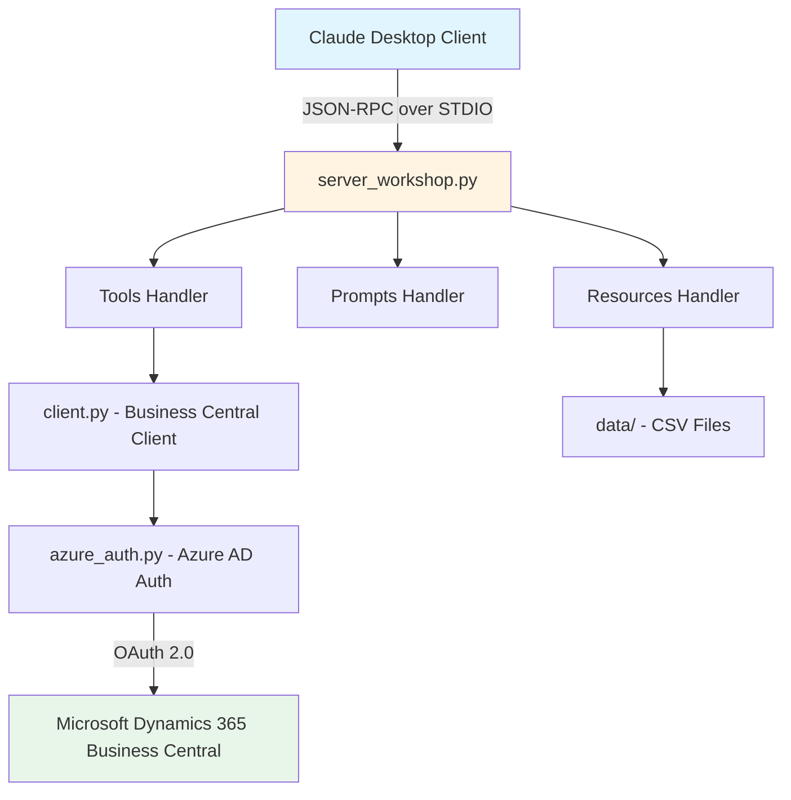

# 🎓 MCP Server Workshop - Support Slides

> **Compact presentation slides for workshop delivery**  
> MCP Server Workshop with STDIO Transport for Claude Desktop  
> Business Central Integration

---

## 📊 SLIDE 1: Workshop Introduction

### 🚀 MCP Server Workshop
**Building an MCP Server with STDIO Transport**

**What we'll build:**
- 🔧 MCP Server with STDIO transport
- 🏢 Business Central API integration
- 💬 Claude Desktop integration
- 📊 Tools, Prompts & Resources

**Duration:** 20-30 minutes hands-on

**Repository:** github.com/javiarmesto/Workshop-MCP-Server-Directions-Lab  
**Download:** Code → Download ZIP (recommended)

**Prerequisites:**
- ✅ Python 3.12+, Claude Desktop
- 🏭 **Business Central Environment** (Standard API v2.0)
- 🔑 Azure AD App Registration + Credentials
- 🧪 Fallback: Mock data (not recommended)

---

## 📊 SLIDE 2: Prerequisites & Setup

### ✅ Required Software
- **Python 3.12+** - [python.org/downloads](https://python.org/downloads)
- **Claude Desktop** - [claude.ai/download](https://claude.ai/download)
- **Terminal/PowerShell** - Basic command line knowledge

### 🏭 Required: Business Central Integration (Workshop Objective)

⚠️ **This workshop targets real BC environments**

**You need:**
- Azure AD Tenant with BC access
- **Business Central Environment:**
  - Company name, Environment name
  - Standard API v2.0 enabled
  - Endpoints: `/companies`, `/items`, `/customers`, `/salesOrders`
- **Azure AD App Registration:**
  - Client ID, Client Secret, Tenant ID
  - API permissions for Dynamics 365 Business Central

### 🧪 Alternative: Mock Data (Not Recommended)
- ⚠️ Only if BC unavailable
- ❌ No authentication, no real API calls
- ❌ Limited to protocol mechanics testing
- **Recommendation:** Get BC access before workshop

---

## 📊 SLIDE 3: Workshop Structure & Objectives

### 📋 9-Step Workshop Flow

**Steps 1-4:** Environment Setup
- Download ZIP and extract
- Python 3.12+ virtual environment
- Install dependencies (`mcp`, `httpx`, `msal`)
- Validate setup with `validate_workshop.py`

**Steps 5-7:** MCP Server Configuration
- Configure Claude Desktop (`claude_desktop_config.json`)
- Test connection with Claude
- Verify tools are available

**Step 8:** Connection Validation
- Test MCP tools in Claude
- Verify prompts and resources

**Step 9:** Hands-On Exercises ⭐
- **Part A:** Test existing tools (get_customers, get_currency_exchange_rates)
- **Part B:** Implement new tools (get_sales_orders, get_payment_terms)

### ✅ Learning Outcomes
- Understand MCP architecture (Tools, Prompts, Resources)
- Configure STDIO transport for Claude Desktop
- Create Business Central API integrations
- Build custom MCP tools with copy-paste examples

---

## 📊 SLIDE 4: MCP Architecture Overview

### 🏗️ System Architecture



### 🔑 Key Components
- **STDIO Transport:** Direct process communication (no ports/networking)
- **Tools:** Functions Claude can call (get_customers, get_items, etc.)
- **Prompts:** Pre-configured templates (customer_analysis, vendor_analysis)
- **Resources:** CSV/JSON data files exposed to Claude
- **Target:** Business Central API integration (OAuth 2.0 + Standard API v2.0)
- **Fallback:** Mock mode available if BC access unavailable (not recommended)

---

## 📊 SLIDE 5: Configuration & Setup

### ⚙️ Quick Setup Commands

```bash
# 1. Download ZIP and extract
# Go to: github.com/javiarmesto/Workshop-MCP-Server-Directions-Lab
# Click "Code" → "Download ZIP" → Extract
cd Workshop-MCP-Server-Directions-Lab-main

# 2. Create virtual environment
python -m venv workshop-env
.\workshop-env\Scripts\activate  # Windows
source workshop-env/bin/activate  # macOS/Linux

# 3. Install dependencies
pip install -r requirements.txt

# 4. Validate setup
python validate_workshop.py
```

### 📝 Claude Desktop Configuration

**Location:**
- Windows: `%APPDATA%\Claude\claude_desktop_config.json`
- macOS: `~/Library/Application Support/Claude/claude_desktop_config.json`

**Config:**
```json
{
  "mcpServers": {
    "bc-workshop-server": {
      "command": "C:\\full\\path\\to\\workshop-env\\Scripts\\python.exe",
      "args": ["C:\\full\\path\\to\\server_workshop.py"]
    }
  }
}
```

⚠️ **Critical:** Use **absolute paths** only!

### ✅ Validation Prompts
```
"What MCP tools do you have available?"
"Show me the top 5 customers"
```

---

## 📊 SLIDE 6: Step 9 - Hands-On Exercises

### 🎯 Part A: Testing Existing Tools (10 min)

**Exercise 1: Test get_customers + customer_analysis**
```
"Show me the list of customers"
"Give me a customer analysis using the prompt"
```

**Exercise 2: Test get_currency_exchange_rates**
```
"Show me currency exchange rates"
"Get exchange rates for USD"
```

### 🎯 Part B: Implementing New Tools (15 min)

**Exercise 3: Implement get_sales_orders**
1. Create `data/sales_orders.csv` (mock data)
2. Add `get_sales_orders()` method in `src/client.py`
3. Register tool in `server_workshop.py` (list_tools)
4. Implement handler in `server_workshop.py` (call_tool)
5. Test: `"Show me sales orders"`

**Exercise 4: Implement get_payment_terms**
1. Create `data/payment_terms.csv` (mock data)
2. Add `get_payment_terms()` method in `src/client.py`
3. Register tool in `server_workshop.py` (list_tools)
4. Implement handler in `server_workshop.py` (call_tool)
5. Test: `"Show me payment terms"`

### 📖 Complete Code
All copy-paste code available in **WORKSHOP_GUIDE_EN.md** (Step 9)

---

## 📊 SLIDE 7: Resources & Next Steps

### 📚 Documentation & References

**Workshop Materials:**
- � `WORKSHOP_GUIDE_EN.md` - Complete step-by-step guide
- ✅ `validate_workshop.py` - Setup validation script
- 📦 `data/` - Mock CSV files for testing
- 💻 Repository: github.com/javiarmesto/Workshop-MCP-Server-Directions-Lab

**MCP Protocol:**
- 🌐 Spec: [spec.modelcontextprotocol.io](https://spec.modelcontextprotocol.io)
- 📖 Docs: [modelcontextprotocol.io](https://modelcontextprotocol.io)
- 🛠️ Python SDK: `pip install mcp`

**Business Central:**
- 📘 [BC API Reference](https://learn.microsoft.com/dynamics365/business-central/dev-itpro/api-reference/)
- 🔐 [Azure AD Auth](https://learn.microsoft.com/azure/active-directory/)

### 🎯 Next Steps

**Today:**
- Complete all Step 9 exercises
- Test with different prompts
- Experiment with mock data

**This Week:**
- Add your own custom tools
- Try real Business Central connection (optional)
- Explore prompts and resources

**This Month:**
- Build tools for your business needs
- Integrate with other APIs
- Share with your team

### 🆘 Troubleshooting

**Server not appearing?**
- Verify absolute paths in config
- Restart Claude Desktop
- Check `validate_workshop.py` passes

**Tools not working?**
- Test: `python server_workshop.py`
- Check mock data files exist
- Review Claude Desktop logs

---


